# SynthiGME-web — Arquitectura del Proyecto

> Emulador web del sintetizador EMS Synthi 100 usando Web Audio API.  
> Última actualización: 20 de febrero de 2026 (sección 20: resaltado de flujo de señal)

---

## 1. Visión General

SynthiGME-web es una aplicación **vanilla JavaScript** (ES Modules) que reproduce la funcionalidad del Synthi 100 en el navegador. No utiliza frameworks de runtime — solo herramientas de build (esbuild, svgo).

### Stack Tecnológico
| Capa | Tecnología |
|------|------------|
| Audio | Web Audio API + AudioWorklet |
| Audio Multicanal | SharedArrayBuffer + Addon C++ (PipeWire, solo Linux) |
| UI | DOM nativo + SVG |
| Build | esbuild (bundler), svgo (optimización SVG) |
| PWA | Service Worker + Web App Manifest |
| Tests | Node.js test runner + Playwright |

---

## 2. Estructura de Carpetas

```
/                           # Raíz del proyecto
├── src/                    # Código fuente de la aplicación web
├── electron/               # Código del wrapper Electron
│   ├── native/             # Addon C++ para audio multicanal (PipeWire)
│   └── *.cjs               # Main process, preload, menú nativo, OSC server, audio multicanal
├── tests/                  # Tests automatizados
│   ├── audio/              # Tests de audio con Playwright
│   ├── worklets/           # Tests de AudioWorklets
│   ├── ui/                 # Tests de UI (modales, etc.)
│   └── */                  # Tests por módulo
├── scripts/                # Scripts de build y utilidades
│   ├── build.mjs           # Build principal (esbuild), lee .env automáticamente
│   ├── build-i18n.mjs      # Genera locales JS desde YAML
│   ├── electron-build.mjs  # Wrapper electron-builder con timestamp
│   ├── telemetry/          # Backend de telemetría (Apps Script + guía)
│   ├── release/            # Scripts de versionado
│   └── tools/              # Herramientas (optimización SVG, etc.)
├── docs/                   # ⚠️ GENERADO - PWA para GitHub Pages
├── dist-app/               # ⚠️ GENERADO - App compilada para Electron
└── dist-electron/          # ⚠️ GENERADO - Instaladores (AppImage, exe)

src/
├── index.html              # Punto de entrada HTML
├── manifest.webmanifest    # Configuración PWA
├── sw.js                   # Service Worker
└── assets/
    ├── css/
    │   └── main.css        # Estilos globales
    ├── icons/              # Iconos Tabler
    ├── panels/             # SVGs de paneles del sintetizador
    ├── pwa/icons/          # Iconos para PWA
    └── js/
        ├── app.js          # Bootstrap y orquestación principal
        ├── core/           # Motor de audio y conexiones
        ├── modules/        # Módulos de audio (osciladores, ruido, etc.)
        ├── ui/             # Componentes de interfaz reutilizables
        ├── navigation/     # Sistema de navegación del viewport
        ├── state/          # Gestión de estado, patches, sesión
        ├── i18n/           # Sistema de internacionalización
        ├── utils/          # Utilidades (logging, audio, canvas, etc.)
        ├── worklets/       # AudioWorklet processors (síntesis en hilo de audio)
        ├── osc/            # Comunicación OSC (Open Sound Control)
        └── panelBlueprints/# Blueprints (estructura) y Configs (parámetros)
```

### 2.1 Créditos de Assets

| Recurso | Autor/Fuente | Licencia |
|---------|--------------|----------|
| Iconos de interfaz (Tabler) | [tabler/tabler-icons](https://github.com/tabler/tabler-icons) | MIT (ver `assets/icons/LICENSE.tabler-icons.txt`) |
| Iconos de paneles del sintetizador | Sylvia Molina Muro | — |
| SVGs de paneles | Basados en el Synthi 100 original de EMS | — |

---

## 3. Módulos JavaScript

### 3.1 Core (`src/assets/js/core/`)

| Archivo | Propósito |
|---------|-----------|
| `engine.js` | `AudioEngine` gestiona el `AudioContext`, buses de salida (8 lógicos → N físicos), registro de módulos, carga de AudioWorklets, y clase base `Module`. Métodos clave: `setOutputLevel()`, `setOutputPan()`, `setOutputFilter()`, `setOutputRouting()` (ruteo multicanal). Incluye sistema de **Filter Bypass** que desconecta el filtro RC cuando está en posición neutral (|v|<0.02) para ahorrar CPU. **Cadena de bus (Cuenca 1982)**: `busInput → [clipper] → VCA → postVcaNode → filtros → muteNode → [dcBlocker] → dcBlockerOut → channelGains → out`. El filtro RC (6 dB/oct, fc≈677Hz) y el DC blocker (fc=1Hz) se crean de forma diferida tras carga de worklets (`_initFilterNodes()`, `_initDCBlockerNodes()`). El nodo `postVcaNode` es el punto de split para re-entrada a matriz (POST-fader, PRE-filtro, PRE-mute, sin DC blocker). Exporta `AUDIO_CONSTANTS` (tiempos de rampa, threshold de bypass) y `setParamSmooth()` (helper para cambios suaves de AudioParam). Ver sección "Output Channel Signal Chain" para diagrama Mermaid detallado |
| `blueprintMapper.js` | `compilePanelBlueprintMappings()` extrae filas/columnas ocultas de blueprints de paneles para configurar las matrices |
| `matrix.js` | Lógica de conexión de pines para matrices pequeñas |
| `oscillatorState.js` | Estado de osciladores: `getOrCreateOscState()`, `applyOscStateToNode()`. Centraliza valores (freq, niveles, pulseWidth, sineSymmetry) y aplicación a nodos worklet/nativos |
| `recordingEngine.js` | `RecordingEngine` gestiona grabación de audio multitrack. Captura samples de buses de salida configurables, ruteo mediante matriz outputs→tracks, exportación a WAV 16-bit PCM. Persistencia de configuración en localStorage |
| `dormancyManager.js` | `DormancyManager` orquesta el sistema de dormancy para optimización de rendimiento. Detecta módulos sin conexiones activas en **ambas matrices (Panel 5 audio y Panel 6 control)** y **suspende su procesamiento DSP** (no solo los silencia). Para osciladores y noise, envía mensaje `setDormant` al worklet que hace early exit en `process()`. Para Output Bus, desconecta el grafo si no tiene entrada de audio NI de Voltage Input. Para InputAmplifier, silencia GainNodes. Para Joystick, silencia GainNodes de rango cuando ningún eje tiene salida en Panel 6. Ahorra ~95% CPU por módulo inactivo. Configurable con opción de debug (toasts) |

> **Nota sobre dispositivos móviles:** El procesamiento de audio del sistema (Dolby Atmos, Audio Espacial, ecualizadores) puede interferir con la síntesis en tiempo real, causando cambios de volumen inesperados o distorsión. Ver sección "Solución de problemas" en README.md.

### 3.2 Worklets (`src/assets/js/worklets/`)

Procesadores de audio que corren en el hilo de audio para síntesis de alta precisión:

| Archivo | Propósito |
|---------|----------|
| `synthOscillator.worklet.js` | Oscilador multi-waveform con **fase maestra unificada**. Modo `single` (1 forma de onda, 1 salida) o modo `multi` (4 formas de onda, 2 salidas). Todas las ondas derivan de una única fase (rampa 0→1 = sawtooth), garantizando coherencia perfecta. Anti-aliasing PolyBLEP, entrada para hard sync, parámetro `detune` para V/Oct, AudioParams individuales para niveles de cada onda. **Dormancy**: soporta mensaje `setDormant` para early exit en `process()`, ahorrando ~95% CPU cuando está inactivo |
| `noiseGenerator.worklet.js` | Generador de ruido blanco con filtro COLOUR IIR de 1er orden (6 dB/oct), misma topología que `outputFilter.worklet.js`. Fuente: white noise (emulación del transistor BC169C). Filtro RC con pot 10K LIN + C 33nF, τ = 3.3×10⁻⁴ s, fc ≈ 965 Hz. AudioParam `colourPosition` (a-rate, -1..+1): -1 = LP dark/pink (atenúa HF), 0 = flat white, +1 = HP bright/blue (+6dB shelf). Coeficientes optimizados: a1 y Kinv constantes, solo δ = p·Kinv varía per-sample. DC-coupled (fmin ≈ 2-3 Hz) para uso dual audio/CV. **Dormancy**: soporta `setDormant` para early exit |
| `scopeCapture.worklet.js` | Captura sincronizada de dos canales para osciloscopio con trigger Schmitt, histéresis temporal, anclaje predictivo y detección de período. **Dormancy**: soporta mensaje `setDormant` para pausar captura |
| `recordingCapture.worklet.js` | Captura de samples de audio multicanal para grabación WAV. Recibe N canales y envía bloques Float32 al hilo principal para acumulación |
| `multichannelCapture.worklet.js` | Captura de 12 canales para salida multicanal nativa. Usa **SharedArrayBuffer** para transferencia lock-free al addon C++ de PipeWire. Ring buffer con índices atómicos, soporta prebuffer configurable |
| `multichannelPlayback.worklet.js` | Reproducción de 8 canales desde entrada multicanal nativa. Lee audio desde **SharedArrayBuffer** donde C++ escribe samples de PipeWire. Flujo inverso a capture: PipeWire → C++ → SAB → worklet → Web Audio. Detecta underflow y rellena con silencio |
| `vcaProcessor.worklet.js` | Emulación del VCA CEM 3330 para canales de salida. Aplica curva 10 dB/V, corte mecánico en dial=0, saturación suave para CV positivo y filtro anti-click de 1 polo (τ=5ms) **después** de la suma fader+CV. La entrada de CV se procesa a sample-rate. **Handler de mensajes**: recibe `{ type: 'resync', dialVoltage }` desde el motor para sincronizar instantáneamente `_voltageSmoothed` al despertar de dormancy, eliminando transitorio DC |
| `cvThermalSlew.worklet.js` | Filtro one-pole asimétrico para emular inercia térmica del VCO CEM 3340. Calentamiento rápido (τ = 150ms, proceso activo) vs enfriamiento lento (τ = 500ms, disipación pasiva). **CRÍTICO**: Implementación con **operaciones aritméticas puras** (`Math.abs()` para detectar dirección) — NO usa condicionales que bloquearían la propagación de señal a AudioParams. Se inserta en cadena CV: `freqCVInput → cvThermalSlew → cvSoftClip → detune`. Configurable en `oscillator.config.js` |
| `outputFilter.worklet.js` | Filtro RC pasivo de 1er orden (6 dB/oct) para Output Channels. Modela el circuito real del plano D100-08 C1: pot 10K LIN + 2× 0.047µF + buffer CA3140 (ganancia 2×). Transición continua LP→plano→HP con un único AudioParam `filterPosition` (k-rate). **Audio**: LP fc(-3dB) ≈ 677 Hz, pendiente -6 dB/oct; HP shelving +6 dB en HF; zona de transición 339-677 Hz (medios-bajos). Coeficientes IIR via transformada bilineal. Carácter musical suave (un solo polo), no corte brusco |
| `cvSoftClip.worklet.js` | Saturación polinómica suave para limitar CV de frecuencia. Usa fórmula pura `y = x - x³·k` (sin condicionales) donde k es coeficiente configurable (rango 0.0001–1.0, por defecto 0.333). Se aplica después del thermal slew para recibir señal pre-suavizada. **Configuración**: coeficiente en `oscillator.config.js` → `softClip.coefficient`. **Limitación superada**: Web Audio API requiere aritmética pura en AudioWorklet para propagación a AudioParam |

### 3.3 Modules (`src/assets/js/modules/`)

Cada módulo representa un componente de audio del Synthi 100:

| Archivo | Módulo | Descripción |
|---------|--------|-------------|
| `pulse.js` | `PulseModule` | Oscilador de onda cuadrada/pulso con ancho variable |
| `noise.js` | `NoiseModule` | Generador de ruido con filtro COLOUR (6 dB/oct) y nivel LOG. Dial colour 0-10 → bipolar -1..+1 → filtro IIR. Dial level 0-10 → ganancia LOG (audio taper 10kΩ). Pasa `processorOptions` (R, C) al worklet |
| `inputAmplifier.js` | `InputAmplifierModule` | 8 canales de entrada con control de ganancia individual |
| `oscilloscope.js` | `OscilloscopeModule` | Osciloscopio dual con modos Y-T y X-Y (Lissajous), trigger configurable |
| `joystick.js` | `JoystickModule` | Control XY bipolar (±8V DC) que emula los joysticks del Synthi 100. Usa `ConstantSourceNode` + `GainNode` por eje (X, Y) sin worklet para máxima eficiencia en señales DC. Knobs Range X/Y independientes (pot 10K LIN, dial 0-10 → gain 0-1). Dormancy: silencia gains cuando ningún eje está conectado en Panel 6, restaura al reconectar. Filas 117-120 en matriz de control. Serialización completa de posición y rangos |
| `outputChannel.js` | `OutputChannel` | Canal de salida individual con VCA CEM 3330 y filtro RC pasivo de corrección tonal (1er orden, 6 dB/oct, fc ≈ 677 Hz). Control tonal bipolar: LP (atenúa agudos) ↔ plano (0 dB) ↔ HP shelving (+6 dB en HF). Pan, nivel y switch on/off. El VCA emula la curva logarítmica 10 dB/V con corte mecánico en posición 0 y saturación suave para CV > 0V. 8 instancias forman el panel de salida. La sincronización del estado on/off se realiza en `engine.start()` para garantizar que los buses de audio existan |
| `outputRouter.js` | `OutputRouterModule` | Expone niveles de bus como entradas CV para modulación |

**Patrón de módulo:**
```javascript
export class MiModulo extends Module {
  constructor(engine, id) { super(engine, id, 'Nombre'); }
  start() { /* crear nodos de audio */ }
  stop() { /* limpiar recursos */ }
  createUI(container) { /* generar controles */ }
}
```

#### Output Channel Signal Chain (Cuenca/Datanomics 1982)

La cadena de señal de los Output Channels sigue el diagrama técnico de la versión Cuenca/Datanomics 1982 del Synthi 100. El VCA se posiciona **antes** de los filtros, permitiendo re-entrada POST-fader a la matriz.

```mermaid
%%{ init: { 'theme': 'base', 'themeVariables': { 'fontSize': '12px' } } }%%
flowchart LR
    %% ═══════════════════════════════════════════════════════
    %% ENTRADA
    %% ═══════════════════════════════════════════════════════
    MATRIX["🔲 Matriz de Audio<br/><i>columnas 42-49</i>"]
    MATRIX --> busInput

    subgraph BUS["Output Channel Bus (×8)"]
        direction LR

        busInput["busInput<br/><small>GainNode</small>"]
        clipper["hybridClipShaper<br/><small>WaveShaperNode</small><br/><i>soft-clip ±12V</i>"]
        levelNode["levelNode<br/><small>GainNode</small><br/><i>VCA CEM 3330</i>"]
        postVcaNode["postVcaNode<br/><small>GainNode</small><br/><i>SPLIT POINT</i>"]

        busInput -.->|"opcional"| clipper --> levelNode
        busInput -->|"sin clipper"| levelNode
        levelNode --> postVcaNode
    end

    %% ═══════════════════════════════════════════════════════
    %% CROSSFADE DE FILTROS (post-VCA)
    %% ═══════════════════════════════════════════════════════
    subgraph FILTROS["Crossfade de Filtros"]
        direction LR
        filterGain["filterGain<br/><small>GainNode</small><br/><i>crossfade</i>"]
        filterNode["filterNode<br/><small>AudioWorkletNode</small><br/><i>RC 1er orden</i><br/><i>fc≈677Hz, 6dB/oct</i>"]
        bypassGain["bypassGain<br/><small>GainNode</small><br/><i>crossfade</i>"]
        
        filterGain --> filterNode
    end

    postVcaNode --> filterGain
    postVcaNode --> bypassGain

    %% ═══════════════════════════════════════════════════════
    %% MUTE + DC BLOCKER (solo ruta de salida)
    %% ═══════════════════════════════════════════════════════
    muteNode["muteNode<br/><small>GainNode</small><br/><i>On/Off</i>"]
    filterNode --> muteNode
    bypassGain --> muteNode

    subgraph DCBLOCK["DC Blocker (protección altavoces)"]
        direction LR
        dcBlockerWorklet["dcBlockerWorklet<br/><small>AudioWorkletNode</small><br/><i>HPF 1er orden</i><br/><i>fc=1Hz</i>"]
        dcBlockerOut["dcBlockerOut<br/><small>GainNode</small>"]
        dcBlockerWorklet --> dcBlockerOut
    end

    muteNode --> dcBlockerWorklet

    %% ═══════════════════════════════════════════════════════
    %% SALIDA A ALTAVOCES
    %% ═══════════════════════════════════════════════════════
    subgraph SALIDA["Salida a Altavoces 🔊"]
        direction LR
        channelGains["channelGains[]<br/><small>GainNode[]</small><br/><i>ruteo multicanal</i>"]
        stereoPanL["stereoPanL<br/><small>GainNode</small>"]
        stereoPanR["stereoPanR<br/><small>GainNode</small>"]
    end

    dcBlockerOut --> channelGains
    dcBlockerOut --> stereoPanL
    dcBlockerOut --> stereoPanR

    channelGains --> masterGains["masterGains[]<br/><small>→ audioCtx.destination</small><br/>🔊"]
    stereoPanL --> stereoBusL["stereoBus.sumL"]
    stereoPanR --> stereoBusR["stereoBus.sumR"]

    %% ═══════════════════════════════════════════════════════
    %% RE-ENTRY (sin DC blocker — DC pasa para CV)
    %% ═══════════════════════════════════════════════════════
    postVcaNode -->|"RE-ENTRY<br/><i>sin DC blocker</i><br/><i>DC pasa para CV</i>"| REENTRY["🔲 Matriz de Audio<br/><i>filas 75-82</i>"]

    %% ═══════════════════════════════════════════════════════
    %% CV EXTERNO
    %% ═══════════════════════════════════════════════════════
    CVIN["CV externo<br/><i>desde matriz</i>"] -.->|"suma con fader"| levelNode

    %% ═══════════════════════════════════════════════════════
    %% ESTILOS
    %% ═══════════════════════════════════════════════════════
    classDef worklet fill:#4a9eff,stroke:#2a6cb8,color:#fff
    classDef gain fill:#f5f5f5,stroke:#999,color:#333
    classDef matrix fill:#ffd700,stroke:#b8960a,color:#333
    classDef split fill:#ff6b6b,stroke:#c44,color:#fff
    classDef output fill:#51cf66,stroke:#2b9e3e,color:#fff

    class filterNode,dcBlockerWorklet worklet
    class busInput,levelNode,muteNode,filterGain,bypassGain,dcBlockerOut,channelGains,stereoPanL,stereoPanR gain
    class MATRIX,REENTRY,CVIN matrix
    class postVcaNode split
    class masterGains output
```



> **Nota**: El diagrama Mermaid se renderiza automáticamente en GitHub.
> Para verlo localmente, usar la extensión "Markdown Preview Mermaid Support" de VS Code.

**Resumen de la cadena:**

```
busInput → [clipper] → VCA → postVcaNode ──→ filterGain → filterNode ─┬→ muteNode → [dcBlocker] → dcBlockerOut → channelGains → 🔊
                                    │         bypassGain ──────────────┘                              └→ stereoPan → stereoBus
                                    └──→ RE-ENTRY a matriz (filas 75-82) — DC pasa sin filtrar
```

**Nodos clave:**

| Nodo | Tipo | Función |
|------|------|---------|
| `busInput` | GainNode | Punto de entrada al bus desde la matriz de audio |
| `hybridClipShaper` | WaveShaperNode | Soft-clip opcional para saturación analógica (emulación raíles ±12V) |
| `levelNode` | GainNode | VCA CEM 3330 emulado. Control de nivel del canal |
| `postVcaNode` | GainNode | **Split point** para re-entrada a matriz. POST-VCA, PRE-filtro, PRE-mute. Las señales DC pasan sin filtrar |
| `filterGain` | GainNode | Crossfade: ganancia de la ruta con filtro (0=bypass, 1=activo) |
| `bypassGain` | GainNode | Crossfade: ganancia de la ruta directa (1=bypass, 0=filtro activo) |
| `filterNode` | AudioWorkletNode | Filtro RC pasivo 1er orden (plano D100-08 C1). LP fc≈677Hz / plano 0dB / HP shelf +6dB. 6 dB/oct |
| `muteNode` | GainNode | Switch On/Off del canal. Solo afecta salida externa |
| `dcBlockerWorklet` | AudioWorkletNode | DC blocker 1er orden (fc=1Hz). Protege altavoces. Solo ruta de salida, NO re-entry |
| `dcBlockerOut` | GainNode | Passthrough post-DC-blocker. Alimenta channelGains y stereoPan |
| `channelGains` | GainNode[] | Routing a salidas físicas (multicanal) |
| `stereoPanL/R` | GainNode | Pan estéreo (ley de igual potencia) hacia stereo buses |

**VCA CEM 3330:**
- Sensibilidad logarítmica: 10 dB/V
- Posición 0 del fader: corte mecánico (ignora CV externo)
- Saturación suave para CV > 0V
- Filtro anti-click de 1 polo (τ = 5ms) **después** de la suma fader+CV
- Curva muy pronunciada: posición 5 ≈ -60dB
- **Modo UI lineal (opcional)**: el slider puede mapearse a ganancia lineal mediante dial equivalente (slider 50% → ganancia 50%). El CV externo sigue aplicando la curva logarítmica 10 dB/V auténtica.
- **Resincronización en dormancy**: cuando un Output Channel despierta de dormancy (modo suspensión para ahorrar CPU), el motor envía mensaje `{ type: 'resync', dialVoltage }` al AudioWorklet VCA para sincronizar instantáneamente el estado del filtro anti-click (`_voltageSmoothed`). Esto elimina el transitorio de ramping que causaba offset DC en la señal de re-entrada.

**Filtro RC pasivo (corrección tonal):**
- Circuito del plano D100-08 C1: pot 10K LIN (RV1) + 2× condensadores 0.047µF (C11, C12) + buffer CA3140 (ganancia 2×)
- **Tipo**: filtro IIR de 1er orden (un solo polo), pendiente de 6 dB/octava
- **Constante de tiempo**: τ = R·C = 10kΩ × 47nF = 4.7×10⁻⁴ s
- **Control bipolar** (dial -5 a +5 → interno -1 a +1):
  - -5 (LP): fc(-3dB) ≈ 677 Hz, atenúa HF gradualmente. A 10 kHz ≈ -23 dB. Sonido oscuro.
  - 0 (Plano): respuesta plana, 0 dB en todo el espectro (20 Hz – 20 kHz). Bypass total.
  - +5 (HP shelf): shelving +6 dB por encima de ~677 Hz. Graves intactos (DC = 0 dB). Sonido brillante.
- **Zona de transición**: 339-677 Hz (medios-bajos, región fundamental de voz e instrumentos)
- **Carácter**: corrección tonal suave y musical, muy diferente de filtros resonantes o de 2º orden (12 dB/oct)
- **Implementación**: AudioWorklet `output-filter` con coeficientes IIR via transformada bilineal. AudioParam `filterPosition` (k-rate). Creación diferida tras carga del worklet.
- **Bypass automático**: cuando |valor| < 0.02, crossfade suave (50ms) a ruta directa para ahorrar CPU

**Re-entrada a matriz:**
- El nodo `postVcaNode` es la fuente para las filas 75-82 de la matriz de audio
- **Sin DC blocker**: la re-entry NO pasa por el DC blocker. Las señales DC legítimas (joystick, voltajes de control) llegan intactas a la matriz para su uso como CV
- El **DC blocker** (fc=1Hz) solo actúa en la ruta de **salida a altavoces** (entre `muteNode` y `channelGains`), protegiendo contra DC sin afectar la re-entry
- Permite encadenar canales de salida (feedback, routing creativo)
- La señal de re-entrada es POST-VCA pero PRE-filtro y PRE-mute, permitiendo silenciar la salida externa sin afectar el routing interno

**Inicialización:**
- Los switches On/Off se sincronizan con el engine en `app.js → engine.start()` wrapper
- Esto garantiza que los `outputBuses[]` existan antes de aplicar el estado de mute

### 3.4 UI (`src/assets/js/ui/`)

Componentes de interfaz reutilizables:

| Archivo | Componente | Descripción |
|---------|------------|-------------|
| `knob.js` | `Knob` | Control rotativo SVG con eventos de arrastre, curvas de respuesta configurable; soporte de modificadores (Ctrl/Cmd 10× más rápido, Shift 10× más preciso) |
| `knobFactory.js` | `createKnobElements()`, `createKnob()` | Factory para crear DOM de knobs. Evita duplicación del markup HTML |
| `toggle.js` | `Toggle` | Interruptor de dos estados con etiquetas personalizables |
| `glowManager.js` | `flashGlow()`, `flashPinGlow()` | Sistema centralizado de halo brillante pulsante en controles. 4 presets configurables (performance/standard/subtle/off), CSS variables dinámicas, persistencia en localStorage. Ver [sección 19](#19-sistema-de-efecto-glow) |
| `toast.js` | `showToast()` | Notificaciones toast temporales con animación fade-out |
| `layoutHelpers.js` | `labelPanelSlot()`, `getOscillatorLayoutSpec()` | Helpers de layout para configurar posición de paneles en la cuadrícula |
| `portraitBlocker.js` | `initPortraitBlocker()` | Bloquea la app en modo portrait, muestra hint para rotar dispositivo |
| `moduleFrame.js` | `ModuleFrame` | Contenedor visual para módulos con título y controles |
| `moduleUI.js` | `ModuleUI` | Clase base para módulos UI con knobs. Centraliza creación de controles, headers y gestión de valores |
| `oscilloscopeDisplay.js` | `OscilloscopeDisplay` | Canvas para visualización de onda con efecto CRT, knobs TIME/AMP/LEVEL, render sincronizado con rAF |
| `noiseGenerator.js` | — | UI para generadores de ruido (knobs colour/level) |
| `randomVoltage.js` | — | UI para generador de voltaje aleatorio |
| `inputAmplifierUI.js` | `InputAmplifierUI` | UI para los 8 canales de entrada (8 knobs de nivel en fila horizontal) |
| `largeMatrix.js` | `LargeMatrix` | Matriz de pines 63×67 con toggle, colores de pin, y soporte para pines inactivos. **Sistema de colores**: click derecho/long press abre menú de selección, colores por contexto (audio/control/oscilloscope), serialización `[row, col, pinType]`. Callbacks `getPinContext`, `onPinColorChange` |
| `pinColorMenu.js` | `PinColorMenu` | Menú contextual singleton para selección de color de pin. Gestiona memoria de último color por contexto, colores CSS desde variables `:root`, integración con `PIN_RESISTANCES` |
| `matrixTooltip.js` | `MatrixTooltip`, `getLabelForSource()`, `getLabelForDest()` | Sistema de tooltips para pines de matriz: muestra "Source → Destination" en hover (desktop) o tap (móvil). Usa `sourceMap`/`destMap` de blueprints compilados |
| `panelManager.js` | `PanelManager` | Gestión de paneles, carga de SVG, posicionamiento |
| `sgmeOscillator.js` | `SgmeOscillator` | UI compuesta de oscilador (knobs + display) |
| `outputRouter.js` | — | Helper para UI del router de salidas |
| `audioSettingsModal.js` | `AudioSettingsModal` | Modal de configuración de audio: matriz de salida (8 buses → N canales físicos), matriz de entrada (N entradas sistema → 8 Input Amplifiers), selección de dispositivos, detección automática de canales, persistencia en localStorage |
| `settingsModal.js` | `SettingsModal` | Modal de ajustes generales: idioma, autoguardado, wake lock, atajos. Pestaña "Visualización" con escala de renderizado, toggle de pines inactivos y opción de respuesta lineal de faders de salida. Persistencia en localStorage |
| `recordingSettingsModal.js` | `RecordingSettingsModal` | Modal de configuración de grabación: selector de número de pistas (1-12), matriz de ruteo outputs→tracks adaptativa, configuración de qué buses del sintetizador van a qué pistas del archivo WAV |
| `confirmDialog.js` | `ConfirmDialog` | Modal de confirmación reutilizable (singleton): título, mensaje, botones personalizables, opción "no volver a preguntar" con persistencia localStorage. Métodos estáticos `show()`, `getRememberedChoice()`, `clearRememberedChoice()` |
| `inputDialog.js` | `InputDialog` | Diálogo de entrada de texto personalizado (singleton): reemplaza `prompt()` nativo, título/placeholder/valor por defecto configurables, soporte i18n |
| `keyboardShortcuts.js` | `KeyboardShortcutsManager` | Gestor centralizado de atajos de teclado (singleton): acciones configurables (mute, record, patches, settings, fullscreen, reset, navegación paneles), persistencia en localStorage, teclas reservadas (Tab, Enter, Escape) |
| `patchBrowser.js` | `PatchBrowser` | Modal para gestionar patches: guardar, cargar, eliminar, renombrar, exportar/importar archivos `.sgme.json`, búsqueda por nombre |
| `quickbar.js` | — | Barra de acciones rápidas para móvil (bloqueo zoom/pan, ajustes, configuración de audio, pantalla completa, **menú PiP**) |
| `pipManager.js` | `initPipManager()`, `openPip()`, `closePip()`, `togglePip()` | Sistema de paneles flotantes (Picture-in-Picture). Permite extraer cualquier panel del layout principal a una ventana flotante independiente con zoom/scroll propios. Funciones: `openAllPips()`, `closeAllPips()`, `getOpenPips()`, `isPipped()`. Persistencia de estado (posición, tamaño, scroll) en localStorage. Constante `ALL_PANELS` define los 7 paneles disponibles |
| `signalFlowHighlighter.js` | `SignalFlowHighlighter` | Resaltado visual de flujo de señal: al hacer hover/tap sobre un módulo o pin, resalta módulos conectados con glow cyan (fuente) y magenta (destino). Modo sin modificador (por defecto) o con tecla configurable. Ver [sección 20](#20-resaltado-de-flujo-de-señal) |
| `electronMenuBridge.js` | `initElectronMenuBridge()` | Puente bidireccional entre menú nativo Electron y renderer. Recibe acciones del menú, envía estado y traducciones, sincroniza toggles (telemetría, OSC, PiP, etc.) |

### 3.5 Navigation (`src/assets/js/navigation/`)

Sistema de navegación del viewport:

| Archivo | Propósito |
|---------|-----------|
| `viewportNavigation.js` | Zoom/pan/pinch del viewport, animación a paneles, botones de enfoque |

#### Gestos Táctiles Soportados

| Gesto | Acción | Notas |
|-------|--------|-------|
| **Un dedo** | Pan (arrastrar) | Solo en zonas no interactivas |
| **Dos dedos** | Pan + Zoom simultáneo | El centroide de los dos dedos controla el pan, la distancia controla el zoom |
| **Pinch** | Zoom con ancla | El zoom se centra en el punto medio entre dedos |

#### Sistema de Bloqueos (Móvil)

La quickbar permite bloquear gestos para evitar navegación accidental:

| Bloqueo | Efecto |
|---------|--------|
| `zoomLocked` | Ignora cambios de distancia en pinch |
| `panLocked` | Ignora desplazamiento del centroide, ancla zoom en centro de viewport |

### 3.6 Utils (`src/assets/js/utils/`)

Utilidades compartidas:

| Archivo | Propósito |
|---------|-----------|
| `audio.js` | Utilidades de audio: `safeDisconnect()` para desconexión segura de nodos |
| `constants.js` | Constantes globales centralizadas (ver sección Constantes) |
| `logger.js` | Sistema de logging con niveles (ver sección de Logging) |
| `canvasBackground.js` | Renderizado de fondos SVG en canvas para móviles |
| `serviceWorker.js` | Registro y actualización del Service Worker |
| `buildVersion.js` | Detección e inyección de versión de build |
| `input.js` | Guardas de interacción: `shouldBlockInteraction()` e `isNavGestureActive()` para evitar conflictos táctiles durante navegación |
| `waveforms.js` | Síntesis de formas de onda: `createPulseWave()` y `createAsymmetricSineWave()` usando Fourier |
| `objects.js` | Utilidades de objetos: `deepMerge()` para combinar configuraciones |
| `wakeLock.js` | `WakeLockManager` para mantener pantalla encendida (Screen Wake Lock API) |
| `errorHandler.js` | Captura global de errores (`window.onerror`, `unhandledrejection`), ring buffer con deduplicación, listeners para telemetría |
| `telemetry.js` | Telemetría anónima opt-in: cola de eventos, flush periódico, offline queue, sendBeacon, rate limiting. Ver [Sección 17](#17-manejo-de-errores-y-telemetría) |

#### Constantes globales (`constants.js`)

Centraliza valores que se reutilizan en múltiples archivos:

| Constante | Valor | Descripción |
|-----------|-------|-------------|
| `OUTPUT_CHANNELS` | 8 | Canales de salida del sintetizador |
| `INPUT_CHANNELS` | 8 | Canales de entrada (input amplifiers) |
| `MAX_RECORDING_TRACKS` | 12 | Pistas máximas de grabación WAV |
| `STORAGE_KEYS` | objeto | Claves de localStorage agrupadas por categoría (ver tabla abajo) |
| `AUTOSAVE_INTERVALS` | objeto | Intervalos de autoguardado: `15s`, `30s`, `1m`, `5m`, `off` |
| `DEFAULT_AUTOSAVE_INTERVAL` | `'30s'` | Intervalo de autoguardado por defecto |
| `isMobileDevice()` | función | Detecta dispositivo móvil via user agent y touch |

**Claves de `STORAGE_KEYS` por categoría:**

| Categoría | Claves |
|-----------|--------|
| Idioma | `LANGUAGE` |
| Audio | `AUDIO_ROUTING`, `INPUT_ROUTING`, `STEREO_BUS_ROUTING`, `OUTPUT_DEVICE`, `INPUT_DEVICE`, `MIC_PERMISSION_DENIED` |
| Grabación | `RECORDING_TRACKS`, `RECORDING_ROUTING` |
| Sesión | `LAST_STATE`, `SAVE_ON_EXIT`, `RESTORE_ON_START`, `ASK_BEFORE_RESTORE` |
| Ajustes | `RESOLUTION`, `REMEMBER_RESOLUTION`, `AUTOSAVE_INTERVAL`, `KEYBOARD_SHORTCUTS` |
| Pantalla | `WAKE_LOCK_ENABLED`, `SHOW_INACTIVE_PINS` |
| PiP/Viewport | `PIP_STATE`, `VIEWPORT_STATE`, `REMEMBER_VISUAL_LAYOUT` |
| Optimizaciones | `OPTIMIZATIONS_DEBUG`, `DORMANCY_ENABLED`, `DORMANCY_DEBUG`, `FILTER_BYPASS_ENABLED`, `FILTER_BYPASS_DEBUG`, `LATENCY_MODE` |
| Emulación voltajes | `VOLTAGE_SOFT_CLIP_ENABLED`, `VOLTAGE_PIN_TOLERANCE_ENABLED`, `VOLTAGE_THERMAL_DRIFT_ENABLED` |
| Telemetría | `TELEMETRY_ENABLED`, `TELEMETRY_ID`, `TELEMETRY_QUEUE` |

**Uso:**
```javascript
import { STORAGE_KEYS, OUTPUT_CHANNELS } from './utils/constants.js';

localStorage.getItem(STORAGE_KEYS.LAST_STATE);
for (let i = 0; i < OUTPUT_CHANNELS; i++) { ... }
```

#### Sistema de Logging (`logger.js`)

Sistema centralizado de logs con niveles configurables según entorno:

| Nivel | Valor | Descripción |
|-------|-------|-------------|
| `NONE` | 0 | Sin logs (silencio total) |
| `ERROR` | 1 | Solo errores críticos |
| `WARN` | 2 | Errores y advertencias |
| `INFO` | 3 | Información general (default en desarrollo) |
| `DEBUG` | 4 | Todo, incluyendo debug detallado |

**Configuración por entorno:**
- **Desarrollo** (localhost, file://): Nivel INFO por defecto
- **Producción** (build): Nivel ERROR (configurado en `scripts/build.mjs` vía `__LOG_LEVEL__`)

**Uso:**
```javascript
import { createLogger } from './utils/logger.js';
const log = createLogger('MiModulo');

log.debug('Detalle interno');    // Solo visible con DEBUG
log.info('Inicializado');        // Visible en desarrollo
log.warn('Posible problema');    // Visible en WARN+
log.error('Error crítico');      // Siempre visible (excepto NONE)
```

**Override en runtime (debugging en producción):**
```javascript
window.__LOG_LEVEL__ = 4;  // Activar DEBUG temporalmente
// Recargar página para aplicar
```

### 3.7 Internacionalización (`src/assets/js/i18n/`)

Sistema de i18n basado en YAML con generación automática de locales.

#### Arquitectura

| Archivo | Propósito |
|---------|----------|
| `translations.yaml` | **Fuente única** de todas las traducciones (editar aquí) |
| `index.js` | Core i18n: `t(key)`, `setLocale()`, `getLocale()`, `onLocaleChange()` |
| `locales/_meta.js` | Metadatos generados (idiomas soportados, por defecto) |
| `locales/es.js` | Traducciones en español (auto-generado) |
| `locales/en.js` | Traducciones en inglés (auto-generado) |

> ⚠️ **Los archivos `locales/*.js` son auto-generados. NO editarlos manualmente.**
> 
> Editar siempre `translations.yaml` y ejecutar `npm run build:i18n`

#### Flujo de trabajo

```
translations.yaml  ──[npm run build:i18n]──►  locales/*.js
     (editar)                                  (generados)
```

#### Estructura del YAML

```yaml
# Metadatos de idiomas (nombres en su idioma nativo)
_meta:
  defaultLocale: es
  languages:
    en: English
    es: Español
    fr: Français  # ← añadir aquí nuevos idiomas

# Traducciones: clave con un valor por idioma
settings.title:
  en: Settings
  es: Ajustes

# Variables usan {placeholder}
toast.resolution:
  en: "Scale: {factor}×"
  es: "Escala: {factor}×"
```

#### Uso en código

```javascript
import { t, setLocale, onLocaleChange } from './i18n/index.js';

// Traducir texto
title.textContent = t('settings.title');  // "Ajustes" o "Settings"

// Con interpolación
toast.textContent = t('toast.resolution', { factor: 2 });  // "Escala: 2×"

// Cambiar idioma (notifica listeners)
await setLocale('en');

// Suscribirse a cambios
const unsub = onLocaleChange(lang => this._updateTexts());
```

#### Añadir nuevos textos

1. Editar `translations.yaml`:
```yaml
mi.nueva.clave:
  en: Text in English
  es: Texto en español
```

2. Regenerar locales:
```bash
npm run build:i18n
```

3. Usar en código:
```javascript
elemento.textContent = t('mi.nueva.clave');
```

#### Añadir un nuevo idioma

1. Añadir el idioma en `_meta.languages`:
```yaml
_meta:
  languages:
    en: English
    es: Español
    fr: Français  # nuevo
```

2. Añadir traducciones a cada clave:
```yaml
settings.title:
  en: Settings
  es: Ajustes
  fr: Paramètres  # nuevo
```

3. Regenerar:
```bash
npm run build:i18n
```

El sistema detectará automáticamente el nuevo idioma y generará `locales/fr.js`.

#### Convención de claves

Las claves siguen el patrón `componente.seccion.elemento`:

| Prefijo | Uso |
|---------|-----|
| `settings.*` | Modal de ajustes generales |
| `audio.*` | Modal de configuración de audio |
| `quickbar.*` | Barra de acciones rápidas |
| `toast.*` | Mensajes toast temporales |
| `error.*` | Mensajes de error |

#### Actualizar componentes existentes para i18n

Para hacer traducible un componente existente:

1. Importar `t` y `onLocaleChange`
2. Guardar referencias a elementos con texto
3. Crear método `_updateTexts()` que actualice todos los textos
4. Suscribirse a cambios: `onLocaleChange(() => this._updateTexts())`

```javascript
import { t, onLocaleChange } from '../i18n/index.js';

constructor() {
  this._create();
  this._unsubscribeLocale = onLocaleChange(() => this._updateTexts());
}

_updateTexts() {
  this.titleElement.textContent = t('mi.titulo');
}
```

### 3.7.1 Configuración de Módulos (`src/assets/js/configs/`)

Parámetros de audio y calibración organizados por tipo de módulo:

```
src/assets/js/configs/
├── index.js              # Índice centralizado (importación agrupada)
└── modules/
    ├── oscillator.config.js
    ├── noise.config.js
    ├── randomVoltage.config.js
    ├── joystick.config.js
    ├── inputAmplifier.config.js
    ├── outputChannel.config.js
    ├── oscilloscope.config.js
    ├── audioMatrix.config.js
    └── controlMatrix.config.js
```

| Archivo | Módulo | Contenido |
|---------|--------|-----------|
| `oscillator.config.js` | Osciladores | Rangos de frecuencia, niveles de salida, deriva térmica, parámetros de voltaje, **rampas de frecuencia para knob** |
| `noise.config.js` | Generadores de ruido | Circuito COLOUR (R=10kΩ, C=33nF, 6 dB/oct), curva LOG del level (base 10), rampas, rangos 0-10 |
| `randomVoltage.config.js` | Random Voltage | Rangos de frecuencia, slew rate |
| `joystick.config.js` | Joysticks (Left/Right) | Filas de matriz (117-120), rampas (posición 10ms, rango 50ms), knobs Range X/Y (0-10, initial 5), curva lineal (pot 10K LIN) |
| `oscilloscope.config.js` | Osciloscopio | Resolución CRT, glow, colores, buffer, trigger Schmitt |
| `inputAmplifier.config.js` | Amplificadores de entrada | Ganancias, atenuaciones, límites |
| `outputChannel.config.js` | Canales de salida | Rangos de filtros, niveles, pan, **rampas para knobs/faders** |
| `audioMatrix.config.js` | Matriz de audio (Panel 5) | Ganancias por cruce, tipos de pin |
| `controlMatrix.config.js` | Matriz de control (Panel 6) | Ganancias CV, tipos de pin |

**Importación centralizada:**
```javascript
import { oscillatorConfig, noiseConfig } from './configs/index.js';
```

---

### 3.8 Panel Blueprints (`src/assets/js/panelBlueprints/`)

Configuración declarativa de **estructura visual** de paneles (slots, layout, mapeo a matriz).

#### Patrón Blueprint vs Config

Los paneles se configuran con **archivos separados** por responsabilidad:

| Tipo | Extensión | Contenido | Cuándo modificar |
|------|-----------|-----------|------------------|
| **Blueprint** | `.blueprint.js` | Estructura visual, slots, layout, mapeo a matriz | Al cambiar posiciones o añadir/quitar módulos |
| **Config** | `.config.js` | Parámetros de audio, rangos de knobs, calibración | Al ajustar sonido o respuesta de controles |

**Ventajas de esta separación:**
- Editar layout sin afectar comportamiento de audio
- Calibrar parámetros sin romper estructura visual
- Reutilizar blueprints con diferentes configuraciones
- Versionado independiente de estructura y calibración

#### Archivos

| Archivo | Tipo | Contenido |
|---------|------|-----------|
| `panel2.blueprint.js` | Blueprint | Layout del panel de osciloscopio (secciones, frame, controles, toggle Y-T/X-Y) |
| `panel3.blueprint.js` | Blueprint | Layout del panel (grid 2×6), slots de osciladores, proporciones de módulos (Noise, RandomCV), mapeo a matriz |
| `panel5.audio.blueprint.js` | Blueprint | Mapa de conexiones de la matriz de audio (filas/columnas), fuentes y destinos |
| `panel6.control.blueprint.js` | Blueprint | Mapa de conexiones de la matriz de control |
| `panel7.blueprint.js` | Blueprint | Layout del Panel 7: 8 Output Channels (Filter, Pan, Switch, Level Fader por canal) |

> **Nota**: Los archivos de configuración (`.config.js`) están en `configs/modules/`. Ver sección 3.7.1.

#### Ejemplo de Blueprint (estructura)
```javascript
// panel3.blueprint.js
export default {
  schemaVersion: 1,
  panelId: 'panel-3',
  layout: {
    oscillators: { columns: 2, rowsPerColumn: 6, oscSize: { width: 200, height: 90 } },
    modulesRow: { height: 80, proportions: { noise1: 2/9, noise2: 2/9, randomCV: 5/9 } }
  },
  oscillatorSlots: [
    { oscIndex: 0, col: 0, row: 0 },  // Osc 1
    { oscIndex: 1, col: 1, row: 0 },  // Osc 2
    // ...
  ],
  modules: {
    noise1: { id: 'noise-1', type: 'noiseGenerator', matrixRow: 89 },
    noise2: { id: 'noise-2', type: 'noiseGenerator', matrixRow: 90 }
  },
  matrixMapping: { noiseGenerators: { noise1: 89, noise2: 90 } }
};
```

#### Ejemplo de Config (parámetros)
```javascript
// configs/modules/noise.config.js — Synthi 100 Cuenca (Datanomics 1982)
export default {
  schemaVersion: 2,
  defaults: {
    colourSmoothingTime: 0.01,
    levelSmoothingTime: 0.03,
    ramps: { colour: 0.05, level: 0.06 }
  },
  colourFilter: {
    potResistance: 10000,   // 10 kΩ pot lineal COLOUR
    capacitance: 33e-9,     // 33 nF → τ = 3.3×10⁻⁴ s, fc ≈ 965 Hz
    order: 1                // 6 dB/oct, un solo polo
  },
  levelCurve: {
    type: 'log',            // Pot LOG 10kΩ (audio taper tipo A)
    logBase: 100            // gain = (100^(dial/10) - 1) / 99
  },
  noise1: {
    knobs: {
      colour: { min: 0, max: 10, initial: 5 },  // 0=LP dark, 5=white, 10=HP bright
      level: { min: 0, max: 10, initial: 0 }     // 0=silencio, 10=~3V p-p
    }
  }
};
```

---

## 3.8 Sistema de Emulación de Voltajes

> **Nuevo en v1.x** — Emulación del modelo eléctrico del Synthi 100 versión Cuenca/Datanomics (1982).

El Synthi 100 utiliza un sistema de **suma por tierra virtual** (virtual-earth summing) donde las señales se mezclan como corrientes a través de resistencias.

### 3.8.1 Organización del Código

El sistema de voltajes se divide en dos capas:

| Ubicación | Contenido |
|-----------|-----------|
| **`utils/voltageConstants.js`** | Constantes globales (conversión digital↔voltaje, resistencias de pin, Rf estándar) y funciones de cálculo |
| **Configs de módulo** (ej: `configs/modules/oscillator.config.js`) | Constantes específicas de cada módulo (niveles de salida, Rf internos, deriva térmica, límites) |

### 3.8.2 Constantes Globales (`voltageConstants.js`)

| Constante | Valor | Descripción |
|-----------|-------|-------------|
| `DIGITAL_TO_VOLTAGE` | 4.0 | 1.0 digital = 4V (rango ±1 = ±4V = 8V p-p) |
| `MAX_VOLTAGE_PP` | 8.0 | Voltaje pico a pico máximo (amplitud total) |
| `VOLTS_PER_OCTAVE` | 1.0 | Estándar de control: 1V/Oct |
| `STANDARD_FEEDBACK_RESISTANCE` | 100000 | Rf estándar (100kΩ) |

```javascript
import { digitalToVoltage, voltageToDigital } from './utils/voltageConstants.js';

digitalToVoltage(1.0);   // → 4.0V
voltageToDigital(-4.0);  // → -1.0
```

### 3.8.3 Resistencias de Pin (Matriz)

Los pines de la matriz contienen resistencias que determinan la ganancia de mezcla según la fórmula de tierra virtual: `Ganancia = Rf / R_pin` (donde Rf = 100kΩ típico).

#### Pines Estándar (Cuenca/Datanomics 1982)

| Color | Resistencia | Tolerancia | Ganancia | Uso típico |
|-------|-------------|------------|----------|------------|
| **Blanco** | 100kΩ | ±10% | ×1 | Audio general (Panel 5) |
| **Gris** | 100kΩ | ±0.5% | ×1 | CV de precisión (Panel 6) |
| **Verde** | 68kΩ | ±10% | ×1.5 | Mezcla ligeramente amplificada |
| **Rojo** | 2.7kΩ | ±10% | ×37 | Osciloscopio (señal fuerte y nítida) |

#### Pines Especiales (Manual técnico - mezcla personalizada)

Documentados en manuales técnicos para aplicaciones de mezcla avanzada:

| Color | Resistencia | Tolerancia | Ganancia | Uso típico |
|-------|-------------|------------|----------|------------|
| **Azul** | 10kΩ | ±10% | ×10 | Boost de señal débil |
| **Amarillo** | 22kΩ | ±10% | ×4.5 | Ganancia media |
| **Cian** | 250kΩ | ±10% | ×0.4 | Señal suave/atenuada |
| **Morado** | 1MΩ | ±10% | ×0.1 | Mezcla sutil (10%) |

#### Pin Prohibido

| Color | Resistencia | Ganancia | Estado |
|-------|-------------|----------|--------|
| **Naranja** | 0Ω | ∞ | ⚠️ **NO IMPLEMENTADO** |

> **Nota sobre el pin naranja:** Con resistencia 0Ω, la fórmula Rf/Rpin da ganancia infinita. En el hardware real, esto cortocircuita el nodo de suma de tierra virtual, destruyendo el amplificador operacional. Existía en versiones antiguas del Synthi para conexiones directas (bypass), pero en la versión Cuenca/Datanomics 1982 su uso está prohibido. En la emulación, está excluido del selector.

#### Colores por Defecto según Contexto

| Contexto | Color | Razón |
|----------|-------|-------|
| Panel 5 (audio) | Blanco | Ganancia unitaria para mezcla limpia |
| Panel 6 (control) | Gris | Precisión ±0.5% para afinación |
| Osciloscopio | Rojo | Alta ganancia (×37) para visualización clara |

### 3.8.4 Fórmula de Tierra Virtual

La mezcla de señales sigue la fórmula:

```
V_destino = Σ(V_fuente / R_pin) × Rf
```

Donde:
- `V_fuente`: Voltaje de salida del módulo fuente
- `R_pin`: Resistencia del pin usado en la conexión
- `Rf`: Resistencia de realimentación del módulo destino (típicamente 100kΩ)

```javascript
import { calculateVirtualEarthSum } from './utils/voltageConstants.js';

// Dos osciladores (4V) con pines blancos (100k) → módulo con Rf=100k
calculateVirtualEarthSum(
  [{ voltage: 4, resistance: 100000 }, { voltage: 4, resistance: 100000 }],
  100000
);  // → 8V (suma lineal sin pérdida)
```

### 3.8.5 Configuración de Osciladores (`configs/modules/oscillator.config.js`)

Los parámetros específicos de voltaje de los osciladores se definen en `defaults.voltage`:

#### Voltajes de Salida por Forma de Onda (Manual Técnico Datanomics 1982)

Basado en el esquema electrónico **D100-02 C1** y el **Manual Técnico de Datanomics (1982)**, el circuito de salida de los osciladores utiliza dos amplificadores de suma con ganancias diferenciadas para compensar las amplitudes nativas de cada forma de onda:

| Forma de onda | Voltaje nativo | Amplificador | Ganancia | Voltaje final |
|---------------|----------------|--------------|----------|---------------|
| **Seno** | 8V p-p | I/C 6 (R28 = 100kΩ) | ×1.0 | **8.0V p-p** |
| **Sierra** | 5.0-7.4V p-p | I/C 6 (R28 = 100kΩ) | ×1.0 | **6.2V p-p** (promedio) |
| **Triángulo** | ~2.7V p-p | I/C 7 (R32 = 300kΩ) | ×3.0 | **8.1V p-p** |
| **Pulso** | ~2.7V p-p | I/C 7 (R32 = 300kΩ) | ×3.0 | **8.1V p-p** |
| **Cuspoide** | 0.5V p-p | — | — | **0.5V p-p** |

> **Nota sobre Cuspoide:** Cuando el control "Sine Shape" (Symmetry) está en posición extrema, el seno sufre una atenuación drástica de 8:1, pasando de 8V p-p a 0.5V p-p. Esta es una característica documentada del hardware original (N.B. 1 del manual).

```javascript
voltage: {
  outputLevels: {
    sine: 8.0,        // 8V p-p (referencia de calibración del sistema)
    sawtooth: 6.2,    // 5.0-7.4V p-p (promedio, ganancia ×1.0)
    pulse: 8.1,       // ~2.7V p-p nativo × 3.0 = 8.1V p-p
    triangle: 8.1,    // ~2.7V p-p nativo × 3.0 = 8.1V p-p
    cusp: 0.5         // 0.5V p-p (seno deformado a cuspoide, ratio 8:1)
  },
  feedbackResistance: {
    sineSawtooth: 100000,   // 100k Ω (R28) - ganancia ×1.0
    pulseTriangle: 300000   // 300k Ω (R32) - ganancia ×3.0 para compensación
  },
  inputLimit: 8.0,          // Soft clipping a 8V p-p
  thermalDrift: {
    maxDeviation: 0.001,    // ±0.1%
    periodSeconds: 120      // 2 minutos
  }
}
```

#### Modelo de Frecuencia (CEM 3340 - Synthi 100 Datanomics 1982)

El modelo de frecuencia de los osciladores reproduce el comportamiento del VCO CEM 3340 documentado en el manual Datanomics 1982:

**Fórmula de conversión dial→frecuencia:**

$$f = f_{ref} \times 2^{\frac{dial - 5}{k} + V_{total}}$$

Donde:
- $f_{ref} = 261$ Hz (C4 MIDI, referencia de afinación)
- $k = 0.95$ unidades de dial por octava
- $V_{total}$ = suma de todas las entradas CV (en voltios, 1V/Oct)

```javascript
import { dialToFrequency } from './state/conversions.js';

// Posición dial 5, sin CV, modo HI → 261 Hz (C4)
dialToFrequency(5, 0, 'HI');  // → 261

// Dial al máximo (10), sin CV, modo HI → ~14.817 Hz
dialToFrequency(10, 0, 'HI'); // → ~14817

// Dial 5, con +1V de CV externo → 522 Hz (una octava arriba)
dialToFrequency(5, 1, 'HI');  // → 522

// Modo LO divide por 10
dialToFrequency(5, 0, 'LO');  // → 26.1
```

**Configuración de tracking** (`defaults.tracking`):

```javascript
tracking: {
  alpha: 0.01,           // Coeficiente de distorsión cuadrática
  linearHalfRange: 2.5   // Zona lineal ±2.5V
}
```

Fuera de la zona lineal (|V| > 2.5V), se aplica distorsión de tracking cuadrática:

$$V_{eff} = V + \alpha \times sign(V) \times (|V| - 2.5)^2$$

**Rangos de frecuencia físicos:**

| Modo | Mínimo | Máximo |
|------|--------|--------|
| HI   | 5 Hz   | 20.000 Hz |
| LO   | 0.5 Hz | 2.000 Hz  |

Estos límites emulan las restricciones del hardware original (condensadores C9/C10).

### 3.8.6 Soft Clipping (Saturación)

Cuando el voltaje de entrada supera el límite de un módulo, se aplica saturación suave con `tanh()`:

```javascript
import { applySoftClip } from './utils/voltageConstants.js';

applySoftClip(10.0, 8.0);  // → ~7.6V (saturado suavemente)
applySoftClip(4.0, 8.0);   // → ~4.0V (sin cambio notable)
```

#### Curva para WaveShaperNode

Para aplicar soft clipping en tiempo real a señales de audio o CV, se usa `createSoftClipCurve()` con un `WaveShaperNode`:

```javascript
import { createSoftClipCurve, VOLTAGE_DEFAULTS } from './utils/voltageConstants.js';

// Crear curva de saturación para límite de ±2 unidades digitales (8V)
const curve = createSoftClipCurve(256, 2.0, 1.0);

// Aplicar a un WaveShaperNode
const waveshaper = audioCtx.createWaveShaper();
waveshaper.curve = curve;
waveshaper.oversample = 'none';  // CV no necesita oversampling
```

#### Cadena CV de Osciladores (Corrección Enero 2026)

Los osciladores aplican suavizado térmico y saturación a la entrada de CV de frecuencia en una **cadena correctamente ordenada**:

```
[Señal CV] → [freqCVInput] → [cvThermalSlew] → [cvSoftClip] → [centsGain=4800] → [detune del worklet]
                  ↓                  ↓                ↓                 ↓
            GainNode         AudioWorklet    AudioWorklet         conversión
                          (inercia 150/500ms) (polinomio puro)     1V → 1 octava
```

**Orden y propósito:**
1. **cvThermalSlew**: AudioWorklet que implementa filtro one-pole asimétrico. Emula masa térmica del CEM 3340:
   - Calentamiento (subida CV): τ = 150ms (rápido, proceso activo)
   - Enfriamiento (bajada CV): τ = 500ms (lento, disipación pasiva)
   - Umbral: solo activa con |ΔCV| > 2V (0.5 digital)
   - **Implementación crítica**: Usa `Math.abs()` para detectar dirección de cambio — **SIN condicionales** que bloquearían AudioParam
   
2. **cvSoftClip**: AudioWorklet que satura suavemente con polinomio puro:
   - Fórmula: `y = x - x³·k` donde k = coeficiente configurable
   - Rango recomendado: 0.0001 (casi desactivado) a 1.0 (saturación fuerte)
   - Por defecto en testing: 0.333 (saturación moderada)
   - **Implementación crítica**: Aritmética pura — **SIN condicionales**
   - Recibe CV pre-suavizado del thermal slew, lo que reduce artefactos de clipping
   
3. **centsGain = 4800**: Factor de conversión que convierte voltaje de CV a cents (modificación del parámetro `detune`)
   - Calibración 1V/octava: +1V CV → +1200 cents (una octava arriba)
   - Conversión: `detune_cents = CV_voltage × 4800 / DIGITAL_TO_VOLTAGE` (donde DIGITAL_TO_VOLTAGE = 4.0)
   - Resultado: +1V CV produce f×2 (una octava)

**Limitación superada (enero 2026):**
- Bug identificado: Cualquier condicional (if, ternario, Math.max/min) en AudioWorklet bloqueaba completamente la propagación de señal hacia AudioParams
- Síntoma: FM modulation no funcionaba a pesar de que tests existentes pasaban (porque probaban conexión a nodos de audio, no a AudioParams)
- Solución: Reemplazar todos los condicionales con operaciones aritméticas puras
- Tests agregados: 14 nuevos tests de integración (`cvChain.audio.test.js`) que prueban específicamente la conexión crítica AudioWorklet → AudioParam

**Configuración:**
- Archivo: `src/assets/js/configs/modules/oscillator.config.js`
- Parámetros:
  ```javascript
  thermalSlew: {
    enabled: true,
    riseTimeConstant: 0.15,    // 150ms
    fallTimeConstant: 0.5,     // 500ms
    threshold: 0.5             // Activación con CV > ±0.5 digital
  },
  softClip: {
    enabled: true,
    coefficient: 0.333         // Saturación polinómica: y = x - x³·k
  }
  ```

### 3.8.7 Rampas para Controles Manuales (Knobs/Sliders)

Los controles manuales (knobs y sliders) aplican **rampas de audio** para evitar "zipper noise" — saltos audibles cuando el usuario gira un knob rápidamente. Estas rampas usan `setTargetAtTime()` de Web Audio API que interpola exponencialmente a nivel de sample rate.

**Comportamiento diferenciado por fuente de control:**

| Fuente | Rampa | Motivo |
|--------|-------|--------|
| **Knob/Slider manual** | ✅ Configurable (200ms default) | Evita clicks al girar rápido |
| **CV de matriz** | ❌ Instantáneo | Modulación precisa, FM/PWM sin latencia |
| **OSC externo** | ❌ Instantáneo | Sincronización remota precisa |
| **Carga de patch** | ❌ Instantáneo | Restaurar estado sin glissando |

**Configuración en `oscillator.config.js`:**

```javascript
audio: {
  // Rampa de frecuencia para knob manual (en segundos)
  // τ = frequencyRampTime/3 para alcanzar ~95% del objetivo
  frequencyRampTime: 0.2,  // 200ms default
  
  // Otros parámetros del oscilador...
  smoothingTime: 0.01      // Para pulseWidth, symmetry, etc.
}
```

**Configuración en `outputChannel.config.js`:**

```javascript
audio: {
  ramps: {
    level: 0.06,   // Fader de nivel: 60ms (más corto para responsividad)
    filter: 0.2,   // Knob de filtro: 200ms
    pan: 0.2       // Knob de pan: 200ms
  }
}
```

**Implementación:**

1. **En `engine.js`**: Los métodos `setFrequency()`, `setOutputLevel()`, `setOutputPan()`, etc. aceptan parámetro opcional `{ ramp }`:
   ```javascript
   // Cambio instantáneo (CV)
   node.setFrequency(440);
   
   // Con rampa (knob manual)
   node.setFrequency(440, 0.2);  // 200ms
   ```

2. **En callbacks de knobs**: Leen el tiempo de rampa del config y lo pasan al método:
   ```javascript
   onChange: value => {
     const ramp = audioConfig.frequencyRampTime ?? 0.2;
     this._updatePanelOscFreq(panelIndex, oscIndex, value, undefined, { ramp });
   }
   ```

### 3.8.8 Clase Module (core/engine.js)

La clase base `Module` incluye métodos para aplicar soft clipping a las entradas. Todos los módulos heredan estos métodos:

| Propiedad/Método | Descripción |
|------------------|-------------|
| `_inputVoltageLimit` | Límite de entrada en voltios (8V por defecto) |
| `_softClipEnabled` | Activa/desactiva saturación (true por defecto) |
| `setInputVoltageLimit(v)` | Configura límite de voltaje personalizado |
| `setSoftClipEnabled(bool)` | Activa/desactiva soft clipping |
| `applyInputClipping(digital)` | Aplica clip a valor digital (convierte ↔ voltaje) |
| `applyVoltageClipping(volts)` | Aplica clip a valor en voltios directamente |

### 3.8.9 Ganancia de Pines de Matriz

La función `calculateMatrixPinGain()` combina tipo de pin, resistencia de realimentación y tolerancia para calcular la ganancia de cada conexión:

```javascript
import { calculateMatrixPinGain } from './utils/voltageConstants.js';

// Pin gris (100k) con Rf estándar (100k) → ganancia 1.0
calculateMatrixPinGain('GREY');           // → 1.0

// Pin rojo (2.7k) → ganancia ~37× (conexión fuerte)
calculateMatrixPinGain('RED');            // → 37.037

// Pin blanco con tolerancia aplicada
calculateMatrixPinGain('WHITE', 100000, { 
  applyTolerance: true, 
  seed: 42  // Reproducible
});                                        // → ~0.9 a ~1.1
```

#### Uso en la Matriz (app.js)

Las funciones `_getPanel5PinGain()` y `_getPanel6PinGain()` usan `calculateMatrixPinGain()` para aplicar el modelo de tierra virtual a cada conexión:

```javascript
// Jerarquía de ganancia:
// 1. pinGains[key] específico (override manual)
// 2. calculateMatrixPinGain(tipo, rf, { tolerancia, seed })
// 3. × rowGains × colGains × matrixGain
```

La configuración de tipos de pin por coordenada se puede definir en los archivos de configuración (`audioMatrixConfig.pinTypes`, `controlMatrixConfig.pinTypes`). Si no se especifica, se usa pin gris por defecto.

### 3.8.10 Tolerancia de Resistencias

La función `applyResistanceTolerance()` genera un error reproducible basado en un seed (ID de conexión), permitiendo que los patches suenen igual al recargarlos:

```javascript
import { applyResistanceTolerance, PIN_RESISTANCES } from './utils/voltageConstants.js';

const { value, tolerance } = PIN_RESISTANCES.GREY;
const actualResistance = applyResistanceTolerance(value, tolerance, connectionId);
// → 100000 * (1 ± 0.005) basado en seed
```

### 3.8.10 Configuración en Settings

Los parámetros de emulación de voltajes se pueden ajustar en **Ajustes → Avanzado → Emulación de Voltajes**:

| Opción | Clave localStorage | Por defecto | Descripción |
|--------|-------------------|-------------|-------------|
| **Saturación suave** | `sgme-voltage-soft-clip-enabled` | ✓ | Aplica `tanh()` cuando las señales superan los límites de entrada |
| **Tolerancia de pines** | `sgme-voltage-pin-tolerance-enabled` | ✓ | Variación realista según tipo de pin (gris ±0.5%, blanco ±10%) |
| **Deriva térmica** | `sgme-voltage-thermal-drift-enabled` | ✓ | Simula drift lento de osciladores CEM 3340 (±0.1%) |

Los valores se leen dinámicamente desde `localStorage` a través de `VOLTAGE_DEFAULTS`:

```javascript
import { VOLTAGE_DEFAULTS } from './utils/voltageConstants.js';

// Lee el valor actual desde localStorage (o default si no existe)
if (VOLTAGE_DEFAULTS.softClipEnabled) {
  // Aplicar saturación...
}
```

Los eventos de cambio se emiten cuando el usuario modifica las opciones:
- `synth:voltageSoftClipChange`
- `synth:voltagePinToleranceChange`
- `synth:voltageThermalDriftChange`

### 3.8.11 Suavizado de Formas de Onda (Waveform Smoothing)

El sistema de suavizado emula dos características eléctricas del Synthi 100 real que impiden transiciones verticales instantáneas:

1. **Slew inherente del módulo**: Los amplificadores operacionales (CA3140) tienen un slew rate finito
2. **Integración por resistencia de pin**: La resistencia del pin + capacitancia parásita del bus (~100pF) crean un filtro RC natural

#### Referencias técnicas (Manual Datanomics 1982)

> "La verticalidad de la onda cuadrada está limitada por el slew rate de los CA3140"
>
> "Con pines de 100kΩ se produce integración o redondeo de los transitorios rápidos. Por ello se usa el pin rojo de 2.7kΩ para el osciloscopio"
>
> "El módulo Slew Limiter tiene un ajuste rápido de 1 V/ms"

#### Frecuencias de corte por tipo de pin

La frecuencia de corte se calcula como: $f_c = \frac{1}{2\pi \cdot R_{pin} \cdot C_{bus}}$

Donde $C_{bus} \approx 100pF$ (capacitancia parásita estimada de la matriz).

| Pin | Resistencia | Frecuencia de corte | Efecto audible |
|-----|-------------|---------------------|----------------|
| **WHITE** | 100kΩ | ~15.9 kHz | Suavizado notable en alta frecuencia |
| **GREY** | 100kΩ | ~15.9 kHz | Igual que blanco |
| **GREEN** | 68kΩ | ~23.4 kHz | Suavizado leve |
| **RED** | 2.7kΩ | ~589 kHz | Prácticamente transparente (bypass) |
| **BLUE** | 10kΩ | ~159 kHz | Casi transparente |
| **YELLOW** | 22kΩ | ~72 kHz | Transparente en rango audible |
| **CYAN** | 250kΩ | ~6.4 kHz | Suavizado fuerte (filtra brillo) |
| **PURPLE** | 1MΩ | ~1.6 kHz | Suavizado muy fuerte |

#### Frecuencia de corte combinada

El suavizado total combina el slew del módulo (~20 kHz) con el filtrado del pin. Se usa el mínimo de ambas frecuencias:

```javascript
const combinedCutoff = Math.min(MODULE_INHERENT_CUTOFF, pinCutoffFrequency);
```

Para el pin WHITE, el pin domina (15.9 kHz < 20 kHz). Para el pin RED, el módulo domina (20 kHz < 589 kHz).

#### Implementación

El suavizado se implementa en dos niveles:

**1. Slew inherente del módulo (worklet)**

Filtro one-pole dentro del AudioWorklet aplicado a pulse y sawtooth:

$$y[n] = \alpha \cdot x[n] + (1 - \alpha) \cdot y[n-1]$$

Donde $\alpha = 1 - e^{-2\pi \cdot f_c / f_s}$

**2. Filtrado RC por pin (matriz)**

Cada conexión de matriz incluye un `BiquadFilterNode` (tipo lowpass) en serie:

```
source → BiquadFilter (pin RC) → GainNode (Rf/Rpin) → destination
```

- El filtro usa Q=0.5 para aproximar respuesta de primer orden
- La frecuencia de corte se configura según `PIN_CUTOFF_FREQUENCIES[pinType]`
- Al cambiar el color del pin, se actualiza la frecuencia con `setValueAtTime()`

**API de filtrado (voltageConstants.js):**

```javascript
// Crear filtro para nueva conexión
const pinFilter = createPinFilter(audioCtx, 'WHITE');

// Actualizar filtro existente (cambio de pin en tiempo real)
updatePinFilter(pinFilter, 'CYAN', audioCtx.currentTime);
```

> **Optimización pendiente:** Para pines con frecuencia de corte muy superior a Nyquist
> (RED, BLUE, YELLOW), el BiquadFilter es efectivamente transparente pero consume CPU.
> Una optimización futura podría omitir el filtro cuando `fc > sampleRate/2`.
> Ver `TODO.md` → "Bypass de filtro RC para pines de alta frecuencia".

#### Tests y helpers de análisis

El módulo `tests/audio/spectralAnalysis.js` incluye funciones para verificar el suavizado:

| Función | Propósito |
|---------|-----------|
| `measureRiseTime(samples, sampleRate)` | Mide el tiempo de subida 10%-90% de transiciones |
| `measureFallTime(samples, sampleRate)` | Mide el tiempo de bajada |
| `measureHighFrequencyEnergy(spectrum, cutoffHz)` | Cuantifica energía en banda alta |
| `compareSpectraAttenuation(before, after)` | Compara atenuación por banda |
| `calculateRCCutoffFrequency(R, C)` | Calcula fc teórica |
| `PIN_CUTOFF_FREQUENCIES` | Constantes pre-calculadas por tipo de pin |

### 3.8.12 Thermal Slew (Inercia Térmica de Osciladores)

> **Referencia:** NotebookLM (Datanomics 1982) — "La masa térmica del VCO CEM 3340 produce inercia en la respuesta a cambios de CV"

Cuando se aplica un cambio brusco de CV a la frecuencia de un oscilador, el hardware real no responde instantáneamente. Los componentes térmicos del VCO CEM 3340 crean un efecto de "portamento involuntario" que es **asimétrico**: el calentamiento (respuesta a CV creciente) es más rápido que el enfriamiento (respuesta a CV decreciente).

#### Comportamiento físico

| Dirección | Proceso | Velocidad |
|-----------|---------|-----------|
| **Subida** (heating) | El transistor de exponenciación se calienta activamente | Rápido (~150ms τ) |
| **Bajada** (cooling) | Disipación pasiva al ambiente | Lento (~500ms τ) |

#### Implementación

El efecto se implementa con el AudioWorklet `CVThermalSlewProcessor` (`worklets/cvThermalSlew.worklet.js`):

```
[CV de matriz] → [freqCVInput] → [cvThermalSlew] → [cvSoftClip] → [detune]
```

**Algoritmo:** Filtro one-pole asimétrico que selecciona la constante de tiempo según la dirección del cambio:

$$y[n] = y[n-1] + \alpha_d \cdot (x[n] - y[n-1])$$

Donde:
- $\alpha_{rise} = 1 - e^{-1 / (f_s \cdot \tau_{rise})}$ cuando $x[n] > y[n-1]$
- $\alpha_{fall} = 1 - e^{-1 / (f_s \cdot \tau_{fall})}$ cuando $x[n] < y[n-1]$

**Umbral de activación:** El efecto solo se aplica cuando la señal CV supera un umbral mínimo (0.5 unidades digitales = 2V). Esto evita aplicar slew a modulaciones sutiles donde no habría efecto térmico perceptible.

#### Configuración (`oscillator.config.js`)

```javascript
thermalSlew: {
  riseTimeConstant: 0.15,   // 150ms (calentamiento, proceso activo)
  fallTimeConstant: 0.5,    // 500ms (enfriamiento, proceso pasivo)
  threshold: 0.5,           // Umbral de activación (0.5 digital = 2V)
  enabled: true
}
```

#### AudioWorklet Parameters

| Parámetro | Tipo | Rango | Descripción |
|-----------|------|-------|-------------|
| `riseRate` | a-rate | 0.0001-0.1 | Coeficiente de slew para subida |
| `fallRate` | a-rate | 0.0001-0.1 | Coeficiente de slew para bajada |
| `threshold` | a-rate | 0-1 | Umbral de activación |

### 3.8.13 Hybrid Clipping (Saturación de Raíles ±12V)

> **Referencia:** NotebookLM (Datanomics 1982) — "Los raíles de alimentación de ±12V producen saturación progresiva"

El Synthi 100 tiene raíles de alimentación de **±12V** que limitan todas las señales del sistema. A diferencia de un hard clip instantáneo, la saturación ocurre en tres zonas progresivas que emulan el comportamiento de los amplificadores operacionales al acercarse a sus límites de alimentación.

#### Tres zonas de saturación

| Zona | Rango (digital) | Rango (voltios) | Comportamiento |
|------|-----------------|-----------------|----------------|
| **Lineal** | |x| < 2.25 | < 9V | Sin modificación (pass-through) |
| **Compresión** | 2.25 ≤ |x| < 2.875 | 9V - 11.5V | Compresión suave con tanh |
| **Hard clip** | |x| ≥ 3.0 | ≥ 12V | Límite absoluto (brick wall) |

#### Curva de saturación

La función `createHybridClipCurve()` genera una curva para `WaveShaperNode`:

```javascript
import { createHybridClipCurve } from './utils/voltageConstants.js';

const curve = createHybridClipCurve(
  2.25,   // linearThreshold: inicio de compresión (9V/4)
  2.875,  // softThreshold: inicio de hard clip (11.5V/4)
  3.0,    // hardLimit: límite absoluto (12V/4)
  2.0,    // softness: agresividad del tanh (1.0-2.5)
  257     // samples: número de muestras (impar para simetría)
);
```

**Fórmula de la zona de compresión:**

$$y = linearThreshold + softRange \cdot \tanh\left(softness \cdot \frac{x - linearThreshold}{softRange}\right)$$

Donde `softRange = softThreshold - linearThreshold`.

#### Aplicación en la Matriz

El `hybridClipShaper` se inserta en cada bus de salida de la matriz, justo después de `busInput`:

```
[Señales mezcladas] → [busInput] → [hybridClipShaper] → [filterLP] → [filterHP] → [levelNode]
```

**Características:**
- **Oversample 2×** para evitar aliasing en las transiciones de saturación
- **Afecta tanto audio como CV** (toda la matriz pasa por los buses)
- **Bypass cuando está deshabilitado** (no crea el nodo)

#### Configuración (`audioMatrix.config.js`)

```javascript
hybridClipping: {
  linearThreshold: 2.25,  // 9V / 4 (digital)
  softThreshold: 2.875,   // 11.5V / 4 (digital)
  hardLimit: 3.0,         // 12V / 4 (digital)
  softness: 2.0,          // Agresividad del tanh
  samples: 257,           // Muestras de la curva (impar)
  enabled: true
}
```

#### Tests (`voltageConstants.test.js`)

| Test | Verificación |
|------|--------------|
| `preserva señal en zona lineal` | |output| ≈ |input| cuando |x| < linearThreshold |
| `comprime en zona intermedia` | |output| < |input| cuando linearThreshold ≤ |x| < softThreshold |
| `hard clip en límite` | |output| ≤ hardLimit para cualquier entrada |
| `curva simétrica` | curve[i] = -curve[n-1-i] para todo i |
| `continuidad en transiciones` | Sin saltos bruscos entre zonas |

---

## 4. Sistema de Patches/Estados

El sistema de patches permite guardar y restaurar el estado completo del sintetizador.

### 4.1 Arquitectura (v2)

El sistema de patches v2 almacena **valores de UI** (posiciones de knobs 0-1, estados de switches, conexiones de matriz). NO almacena valores de audio (Hz, ms).

```
SERIALIZACIÓN                           FORMATO DE PATCH
─────────────                           ────────────────
app.js                                  modules.oscillators['panel3-osc-1']
├── _serializeCurrentState()              └── knobs: [0, 0.5, 0.3, ...]  ← valores 0-1
│   └── ui.serialize() por módulo         └── rangeState: 'hi'
└── _applyPatch()                       modules.noise['panel3-noise-1']
    └── ui.deserialize() por módulo       └── colour: 0.3, level: 0.7   ← valores 0-1
                                        modules.matrixAudio.connections
                                          └── [[row, col, color?], ...]
```

**Beneficios:**
- Patches más simples y compactos
- Cambiar fórmulas de conversión (e.g., curva de frecuencia) no rompe patches
- Menor complejidad en serialización/deserialización

```
src/assets/js/state/
├── index.js          # Re-exports de storage, schema, migrations
├── schema.js         # Estructura de patches, validación, FORMAT_VERSION
├── storage.js        # Persistencia: IndexedDB para patches, localStorage para sesión
├── conversions.js    # Conversiones para displays (NO para patches)
├── migrations.js     # Migraciones entre versiones de formato
└── sessionManager.js # Singleton que gestiona ciclo de sesión
```

> **Nota:** `conversions.js` contiene `dialToFrequency()`, `knobToPhysical()`, etc. Estas funciones se usan para **displays y tooltips**, no para la persistencia de patches.

### 4.1.1 SessionManager

El `sessionManager` es un singleton que centraliza la gestión del ciclo de vida de la sesión:

| Método | Propósito |
|--------|-----------|
| `setSerializeCallback(fn)` | Registra función que serializa el estado actual |
| `setRestoreCallback(fn)` | Registra función que aplica un patch |
| `markDirty()` | Marca que hay cambios sin guardar |
| `configureAutoSave()` | Configura autoguardado periódico según preferencias |
| `saveOnExit()` | Guarda estado en `beforeunload` |
| `maybeRestoreLastState(options)` | Pregunta al usuario si quiere restaurar el último estado |

**Uso:**
```javascript
import { sessionManager } from './state/sessionManager.js';

// Configurar callbacks
sessionManager.setSerializeCallback(() => this._serializeCurrentState());
sessionManager.setRestoreCallback((patch) => this._applyPatch(patch));

// Marcar cambios
sessionManager.markDirty();

// Restaurar si hay estado guardado
await sessionManager.maybeRestoreLastState({ dialogOptions });
```

### 4.2 Almacenamiento

| Tipo | Ubicación | Propósito |
|------|-----------|-----------|
| **Patches guardados** | IndexedDB `synthigme-patches` | Patches con nombre guardados manualmente por el usuario |
| **Último estado** | localStorage `synthigme-last-state` | Autoguardado periódico y al cerrar, para recuperación |
| **Configuración** | localStorage `synthigme-autosave-interval` | Intervalo de autoguardado seleccionado |

### 4.3 Formato de Patch (v2)

Los patches guardan **valores de UI (0-1)**, no valores de audio.

```javascript
{
  formatVersion: 2,           // ← v2 = valores UI
  appVersion: "0.3.0-140",
  name: "Mi Patch",
  savedAt: "2026-01-25T...",
  modules: {
    oscillators: {
      // Array de 7 valores de knob (0-1): [pulseLevel, pulseWidth, sineLevel, sineSymmetry, triLevel, sawLevel, freq]
      "panel3-osc-1": { knobs: [0, 0.5, 0, 0.5, 0, 0, 0.5], rangeState: "hi" }
    },
    noise: {
      // Objeto clave-valor con valores de knob (0-1)
      "panel3-noise-1": { colour: 0.5, level: 0.7 }
    },
    randomVoltage: { ... },
    outputFaders: { 
      channels: [
        { level: 0.5, filter: 0, pan: 0, power: true },
        ...
      ]
    },
    inputAmplifiers: { 
      "input-amplifiers": { levels: [0, 0.5, 0.3, 0, 0, 0, 0, 0] }
    },
    // Conexiones: [row, col] o [row, col, pinType]
    matrixAudio: { connections: [[67, 36], [89, 36, "GREEN"]] },
    matrixControl: { connections: [[83, 30]] }
  }
}
```

> **Nota sobre conversiones:** Los valores `knobs[6]` (frecuencia) se guardan como posición de dial (0-10), no como Hz. La conversión a Hz se hace en tiempo real con `dialToFrequency()` cuando el knob cambia.
```

### 4.4 Autoguardado

El sistema guarda automáticamente el estado para prevenir pérdida de trabajo:

| Evento | Comportamiento |
|--------|----------------|
| **Intervalo periódico** | Guarda cada X segundos/minutos (configurable en Ajustes) |
| **Cerrar página** | Guarda en `beforeunload` (incluye recarga, cierre de pestaña, etc.) |
| **Al iniciar** | Pregunta al usuario si desea restaurar el último estado guardado |

**Opciones de intervalo:** Desactivado, 30s, 1m, 5m, 10m

> ⚠️ `beforeunload` se dispara en **cualquier** cierre o recarga (F5, Ctrl+R, cerrar pestaña, etc.)

### 4.5 Serialización

Cada módulo UI que guarda estado implementa el **contrato Serializable** definido en `state/schema.js`.

#### Tipos de Estado Serializado

| Tipo | Estructura | Usado por |
|------|------------|-----------|
| `OscillatorState` | `{ knobs: number[], rangeState: 'hi'|'lo' }` | SGME_Oscillator |
| `KnobModuleState` | `{ [key]: number }` | ModuleUI, NoiseGenerator, RandomVoltage |
| `LevelsState` | `{ levels: number[] }` | InputAmplifierUI, OutputFaderModule |
| `MatrixState` | `{ connections: Array<[row, col] | [row, col, pinType]> }` | LargeMatrix (pinType opcional: 'WHITE', 'GREY', 'GREEN', 'RED') |

#### Contrato Serializable

```javascript
/**
 * @typedef {Object} Serializable
 * @property {function(): SerializedState} serialize - Retorna el estado actual
 * @property {function(SerializedState): void} deserialize - Restaura estado
 */

// Ejemplo: SGME_Oscillator
serialize() {
  return {
    knobs: this.knobs.map(k => k.getValue()),
    rangeState: this.rangeState
  };
}

deserialize(data) {
  if (!data) return;
  if (Array.isArray(data.knobs)) {
    data.knobs.forEach((v, i) => {
      if (this.knobs[i] && typeof v === 'number') {
        this.knobs[i].setValue(v);
      }
    });
  }
}
```

#### Validación (opcional)

Para debugging, se puede usar `validateSerializedData()`:

```javascript
import { validateSerializedData, SERIALIZATION_SCHEMAS } from './state/schema.js';

const result = validateSerializedData(data, SERIALIZATION_SCHEMAS.oscillator);
if (!result.valid) {
  console.warn('Invalid data:', result.errors);
}
```

### 4.6 Módulos con Serialización

| Clase | Archivo | Tipo de Estado | Estructura |
|-------|---------|----------------|------------|
| `SGME_Oscillator` | `ui/sgmeOscillator.js` | `OscillatorState` | `{ knobs: number[7], rangeState }` |
| `ModuleUI` (base) | `ui/moduleUI.js` | `KnobModuleState` | `{ [key]: number }` |
| `NoiseGenerator` | `ui/noiseGenerator.js` | `KnobModuleState` | `{ colour, level }` |
| `RandomVoltage` | `ui/randomVoltage.js` | `KnobModuleState` | `{ mean, variance, voltage1, voltage2, key }` |
| `InputAmplifierUI` | `ui/inputAmplifierUI.js` | `LevelsState` | `{ levels: number[8] }` |
| `OutputChannelsPanel` | `modules/outputChannel.js` | `OutputChannelsState` | `{ channels: [{level, filter, pan, power}] }` |
| `LargeMatrix` | `ui/largeMatrix.js` | `MatrixState` | `{ connections: [row, col][] }` |

### 4.7 PatchBrowser UI

Modal para gestionar patches (`ui/patchBrowser.js`):

| Acción | Descripción |
|--------|-------------|
| **Guardar** | Serializa estado actual, pide nombre, guarda en IndexedDB |
| **Cargar** | Selecciona patch, confirma, aplica `deserialize()` a todos los módulos |
| **Eliminar** | Borra patch de IndexedDB |
| **Renombrar** | Cambia nombre del patch |
| **Exportar** | Descarga como archivo `.sgme.json` |
| **Importar** | Carga archivo `.sgme.json` y lo guarda en IndexedDB |
| **Buscar** | Filtra lista de patches por nombre |

### 4.8 Flujo de Datos

```
┌─────────────┐     serialize()      ┌──────────────┐
│  UI Modules │ ──────────────────► │ Patch Object │
│  (knobs,    │                      │  { modules } │
│   matrix)   │ ◄────────────────── │              │
└─────────────┘    deserialize()     └──────────────┘
                                           │
                    ┌──────────────────────┼──────────────────────┐
                    ▼                      ▼                      ▼
             ┌─────────────┐       ┌──────────────┐      ┌───────────────┐
             │  IndexedDB  │       │ localStorage │      │  .sgme.json   │
             │  (patches)  │       │ (last-state) │      │  (export)     │
             └─────────────┘       └──────────────┘      └───────────────┘
```

### 4.9 Uso en Código

```javascript
// Serializar estado actual
const state = this._serializeCurrentState();  // { modules: {...} }

// Guardar en IndexedDB
import { savePatch } from './state/index.js';
await savePatch({ name: 'Mi Patch', ...state });

// Cargar y aplicar
import { loadPatch } from './state/index.js';
const patch = await loadPatch(patchId);
await this._applyPatch(patch);

// Listar patches
import { listPatches } from './state/index.js';
const patches = await listPatches();  // [{ id, name, savedAt }, ...]
```

---

## 5. Sistema de Osciloscopio

El osciloscopio es uno de los módulos más complejos, implementando técnicas profesionales de estabilización visual.

### Arquitectura

```
┌─────────────────────────────────────────────────────────────┐
│                 AUDIO THREAD (Worklet)                      │
│  scopeCapture.worklet.js                                    │
│  ┌─────────────────────────────────────────────────────┐    │
│  │ Ring Buffer (2× bufferSize)                         │    │
│  │ ├── Schmitt Trigger (histéresis de nivel)           │    │
│  │ ├── Histéresis temporal (holdoff entre triggers)    │    │
│  │ ├── Detección de período (ciclos completos)         │    │
│  │ └── Anclaje predictivo (estabilidad entre frames)   │    │
│  └─────────────────────────────────────────────────────┘    │
│           │ postMessage @ ~43 Hz                            │
└───────────┼─────────────────────────────────────────────────┘
            ▼
┌─────────────────────────────────────────────────────────────┐
│                    MAIN THREAD                              │
│  ┌───────────────────┐     ┌────────────────────────────┐   │
│  │ OscilloscopeModule│────▶│ OscilloscopeDisplay        │   │
│  │ oscilloscope.js   │     │ oscilloscopeDisplay.js     │   │
│  │ - Gestión worklet │     │ - Canvas con efecto CRT    │   │
│  │ - Callbacks datos │     │ - Render loop (rAF sync)   │   │
│  │ - Setters config  │     │ - Knobs TIME/AMP/LEVEL     │   │
│  └───────────────────┘     │ - Indicador TRIG/AUTO      │   │
│                            └────────────────────────────┘   │
└─────────────────────────────────────────────────────────────┘
```

### Técnicas de Estabilización del Trigger

| Técnica | Propósito | Configuración |
|---------|-----------|---------------|
| **Schmitt Trigger** | Evita disparos múltiples por oscilación cerca del umbral | `schmittHysteresis: 0.05` (5% del rango) |
| **Histéresis temporal** | Ignora triggers por armónicos/ruido | `triggerHysteresis: 150` samples |
| **Detección de período** | Muestra solo ciclos completos | Automático entre triggers |
| **Anclaje predictivo** | Predice posición del siguiente trigger | Basado en período anterior |

### Modos de Visualización

- **Y-T (Dual Beam)**: Forma de onda tradicional (amplitud vs tiempo) con **dos líneas en posiciones fijas**
  - Las líneas se posicionan en los tercios del display, dividiéndolo en 3 partes iguales:
    ```
    ┌─────────────────────────┐
    │      (espacio 1/3)      │
    ├─────── BEAM 1 ──────────┤  ← a 1/3 del alto
    │      (espacio 1/3)      │
    ├─────── BEAM 2 ──────────┤  ← a 2/3 del alto
    │      (espacio 1/3)      │
    └─────────────────────────┘
    ```
  - El Beam 2 solo se dibuja si hay señal significativa conectada a las columnas X
  - Ambos beams usan verde por defecto (como el original), pero los colores son configurables (`lineColor`, `lineColor2`, `glowColor`, `glowColor2`)
- **X-Y (Lissajous)**: Canal X horizontal, canal Y vertical (un solo trazo centrado)

### Efecto CRT

El display simula la apariencia de un osciloscopio analógico:
- Resolución interna baja (400×300) para aspecto pixelado
- Línea gruesa (3px) con puntas redondeadas
- Glow (shadowBlur) para fosforescencia del fósforo

### Sincronización con Monitor

El render usa `requestAnimationFrame` para sincronizar el dibujo con el refresco del monitor (60+ Hz), evitando tearing aunque el worklet envíe datos a ~43 Hz.

---

## 6. Sistema de Grabación de Audio

El sistema de grabación permite exportar audio multitrack a formato WAV, capturando directamente de los buses de salida.

### Arquitectura

```
┌─────────────────────────────────────────────────────────────┐
│                    MAIN THREAD                              │
│  ┌───────────────────┐     ┌────────────────────────────┐   │
│  │  RecordingEngine  │────▶│  RecordingSettingsModal    │   │
│  │ recordingEngine.js│     │ recordingSettingsModal.js  │   │
│  │ - Start/Stop      │     │ - Configurar tracks        │   │
│  │ - Routing matrix  │     │ - Matriz outputs→tracks    │   │
│  │ - WAV export      │     │ - UI de configuración      │   │
│  └────────┬──────────┘     └────────────────────────────┘   │
│           │ connect()                                        │
│           ▼                                                  │
│  ┌───────────────────────────────────────────────────┐      │
│  │  AudioWorkletNode (recording-capture-processor)   │      │
│  │  - Recibe N canales (buses ruteados)              │      │
│  └────────┬──────────────────────────────────────────┘      │
└───────────┼─────────────────────────────────────────────────┘
            │ postMessage (Float32 samples)
┌───────────┼─────────────────────────────────────────────────┐
│           ▼           AUDIO THREAD (Worklet)                │
│  ┌──────────────────────────────────────────────────────┐   │
│  │ RecordingCaptureProcessor                            │   │
│  │ recordingCapture.worklet.js                          │   │
│  │ - Copia bloques de 128 samples por canal             │   │
│  │ - Envía al main thread para acumulación              │   │
│  └──────────────────────────────────────────────────────┘   │
└─────────────────────────────────────────────────────────────┘
```

### Matriz de Ruteo

El sistema usa una matriz configurable para determinar qué buses de salida van a qué pistas del archivo WAV:

| Configuración | Descripción |
|---------------|-------------|
| **Número de pistas** | 1-8 tracks en el archivo WAV final |
| **Matriz outputs→tracks** | Cada bus de salida puede rutearse a una o más pistas |
| **Por defecto** | Bus 1→Track 1, Bus 2→Track 2, etc. (mapeo diagonal) |

### Formato de Exportación

- **Formato**: WAV (RIFF)
- **Bits por sample**: 16-bit PCM
- **Sample rate**: Igual que AudioContext (típicamente 44100 o 48000 Hz)
- **Canales**: Configurable (1-8 tracks)

### Flujo de Grabación

```
┌─────────────┐    ┌────────────────┐    ┌─────────────────┐
│ Bus Outputs │───▶│ Routing Matrix │───▶│ Track Mixers    │
│ (8 buses)   │    │ (gains 0/1)    │    │ (GainNodes)     │
└─────────────┘    └────────────────┘    └───────┬─────────┘
                                                  │
                   ┌──────────────────────────────▼─────────┐
                   │     RecordingCaptureProcessor          │
                   │     (AudioWorklet)                     │
                   └────────────────────┬───────────────────┘
                                        │ Float32 chunks
                                        ▼
                   ┌────────────────────────────────────────┐
                   │   Track Buffers (acumulación)          │
                   │   Float32Array[] por track             │
                   └────────────────────┬───────────────────┘
                                        │ stop()
                                        ▼
                   ┌────────────────────────────────────────┐
                   │   WAV Encoder (16-bit PCM)             │
                   │   → Descarga archivo .wav              │
                   └────────────────────────────────────────┘
```

### Persistencia

| Dato | Almacenamiento | Clave localStorage |
|------|----------------|---------------------|
| Número de pistas | localStorage | `synthigme-recording-tracks` |
| Matriz de ruteo | localStorage | `synthigme-recording-routing` |

### API de Uso

```javascript
// Obtener RecordingEngine
const recording = app.recordingEngine;

// Configurar pistas y ruteo (vía RecordingSettingsModal)
recording.trackCount = 4;
recording.setRouting(busIndex, trackIndex, gain);

// Iniciar/detener grabación
await recording.start();
const wavBlob = await recording.stop();  // Retorna Blob WAV

// Descargar archivo
const url = URL.createObjectURL(wavBlob);
const a = document.createElement('a');
a.href = url;
a.download = `recording-${Date.now()}.wav`;
a.click();
```

---

## 7. Sistema de Atajos de Teclado

Gestor centralizado de shortcuts con soporte para personalización y persistencia.

### Arquitectura

El sistema usa un singleton `KeyboardShortcutsManager` que:
- Registra un único listener `keydown` global
- Mapea combinaciones de teclas a acciones
- Soporta modificadores (Shift, Ctrl, Alt)
- Persiste configuración personalizada en localStorage

### Atajos por Defecto

| Acción | Tecla | Descripción |
|--------|-------|-------------|
| `mute` | `M` | Mute global / panic button — silencia toda la salida |
| `record` | `R` | Iniciar/detener grabación de audio |
| `patches` | `P` | Abrir/cerrar navegador de patches |
| `settings` | `S` | Abrir/cerrar modal de ajustes |
| `fullscreen` | `F` | Alternar pantalla completa |
| `reset` | `Shift+I` | Reiniciar sintetizador a valores por defecto (con confirmación) |
| `panel1` | `1` | Navegar al Panel 1 |
| `panel2` | `2` | Navegar al Panel 2 |
| `panel3` | `3` | Navegar al Panel 3 |
| `panel4` | `4` | Navegar al Panel 4 |
| `panel5` | `5` | Navegar al Panel 5 (Matriz Audio) |
| `panel6` | `6` | Navegar al Panel 6 (Matriz Control) |
| `panelOutput` | `7` | Navegar al Panel de Salida |
| `overview` | `0` | Vista general (todos los paneles) |

### Teclas Reservadas

Las siguientes teclas no pueden asignarse a acciones:
- `Tab` — Navegación del foco
- `Enter` — Confirmación
- `Escape` — Cancelación/cierre
- `Space` — Interacción con controles

### Eventos Disparados

Las acciones emiten eventos personalizados en `document`:

| Evento | Acción |
|--------|--------|
| `synth:toggleMute` | Mute global |
| `synth:toggleRecording` | Grabación |
| `synth:togglePatches` | Navegador patches |
| `synth:toggleSettings` | Modal ajustes |
| `synth:resetToDefaults` | Reinicio (tras confirmación) |

### Persistencia

| Dato | Clave localStorage |
|------|---------------------|
| Atajos personalizados | `synthigme-keyboard-shortcuts` |

### API de Uso

```javascript
import keyboardShortcuts from './ui/keyboardShortcuts.js';

// Habilitar/deshabilitar
keyboardShortcuts.enable();
keyboardShortcuts.disable();

// Obtener atajo actual para una acción
const shortcut = keyboardShortcuts.get('mute');  // { key: 'm', shift: false, ... }

// Modificar atajo
keyboardShortcuts.set('mute', { key: 'x', shift: true, ctrl: false, alt: false });

// Resetear a defaults
keyboardShortcuts.reset();

// Suscribirse a cambios
keyboardShortcuts.onChange(shortcuts => console.log(shortcuts));
```

---

## 8. Flujo de Audio

```
┌─────────────┐     ┌─────────────┐     ┌─────────────┐
│  Módulos    │────▶│   Matriz    │────▶│   Buses     │
│ (Osc, Noise)│     │  de Audio   │     │  Lógicos    │
└─────────────┘     └─────────────┘     └──────┬──────┘
                                               │
                    ┌─────────────┐     ┌──────▼──────┐
                    │   Audio     │◀────│   Router    │
                    │  Context    │     │   Maestro   │
                    │ destination │     │  (L/R mix)  │
                    └─────────────┘     └─────────────┘
```

1. **Módulos** producen señales de audio y las exponen como `AudioNode`
2. **Matriz de Audio** (Panel 5) determina qué módulos se conectan a qué buses
3. **Buses Lógicos** (8) suman señales y aplican nivel (faders)
4. **Router Maestro** mezcla los 8 buses en salida estéreo (L/R)
5. **AudioContext.destination** emite el audio final

---

## 8.1 Optimizaciones de Rendimiento

El sistema incluye varias optimizaciones para reducir carga de CPU, especialmente importantes en dispositivos móviles:

### Dormancy (Suspensión de Procesamiento)

El `DormancyManager` detecta módulos de audio sin conexiones activas en las matrices y **suspende su procesamiento DSP**, no solo los silencia.

```
┌──────────────────┐                   ┌──────────────────┐
│   Matriz Audio   │───┐    ┌─────────▶│    Output Bus    │
│   (conexiones)   │   │    │  activo  │  (procesando)    │
└──────────────────┘   │    │          └──────────────────┘
                       │    │
                       ▼    │
               ┌───────────────────┐
               │  DormancyManager  │
               │  (analiza matriz) │
               └───────────────────┘
                       │    │
                       │    │          ┌──────────────────┐
                       │    └─────────▶│   Output Bus     │
                       │       dormant │  (silenciado)    │
                       │               └──────────────────┘
                       ▼
               ┌───────────────────┐
               │  Oscilador sin    │──▶ SUSPENDIDO
               │   conexiones      │    (early exit)
               └───────────────────┘
```

**Comportamiento:**
- Analiza **ambas matrices** (Panel 5 audio y Panel 6 control) en cada cambio
- Módulos sin conexiones relevantes → marcados como dormant
- **Osciladores dormant**: mensaje `setDormant` al worklet → `process()` hace early exit (llena buffers con ceros sin calcular ondas). Ahorra ~95% CPU del worklet. La fase se mantiene para coherencia al despertar.
- **NoiseModule dormant**: mensaje `setDormant` al worklet noiseGenerator → early exit sin generar ruido. Silencia levelNode.
- **Output Bus dormant**: desconecta `busInput` del grafo (de `filterLP` si filtros activos, o de `levelNode` si bypass). Los filtros LP/HP no reciben audio y no consumen CPU. Un Output Bus está **activo** si tiene entrada desde Panel 5 (audio) **O** desde Panel 6 (Voltage Input en columnas 42-45).
- **InputAmplifier dormant**: silencia los 8 GainNodes. Guarda y restaura niveles al despertar.
- **Oscilloscope dormant**: mensaje `setDormant` al worklet scopeCapture → pausa captura de señal y procesamiento de trigger Schmitt.

**Flujo de mensajes (ejemplo oscilador):**
```
DormancyManager.setDormant(true)
       │
       ▼
app.js: entry.setDormant(dormant)
       │
       ├──▶ multiOsc.port.postMessage({ type: 'setDormant', dormant: true })
       │
       └──▶ Worklet: this.dormant = true → process() hace early exit
```

**Flujo de mensajes (ejemplo Output Bus):**
```
DormancyManager → bus.setDormant(true)
       │
       ├──▶ if (bypassed) bus.input.disconnect(bus.levelNode)
       │    else bus.input.disconnect(bus.filterLP)
       │
       └──▶ Filtros LP/HP no reciben audio → 0 CPU
```

**Configuración:** Ajustes → Avanzado → Optimizaciones → Dormancy

### Filter Bypass (Desconexión de Filtros)

Cada output bus tiene filtros LP/HP en serie. Cuando el filtro está en posición neutral (|valor| < 0.02), los nodos `BiquadFilterNode` se desconectan del grafo de audio.

```
FILTROS ACTIVOS (valor ≠ 0):
busInput → filterLP → filterHP → levelNode → ...

BYPASS (valor ≈ 0):
busInput ─────────────────────▶ levelNode → ...
           (filtros desconectados)
```

**Beneficio:** Los BiquadFilter desconectados no consumen CPU.

**Umbral:** `AUDIO_CONSTANTS.FILTER_BYPASS_THRESHOLD = 0.02`

**Configuración:** Ajustes → Avanzado → Optimizaciones → Filter Bypass

### Modo de Latencia (latencyHint)

El `AudioContext` se crea con un `latencyHint` que determina el tamaño del buffer:

| Modo | latencyHint | Buffer típico | Uso recomendado |
|------|-------------|---------------|-----------------|
| Interactivo | `'interactive'` | ~10ms | Desktop, baja latencia |
| Reproducción | `'playback'` | ~50-100ms | Móviles, estabilidad |

**Comportamiento por defecto:**
- **Móviles** (detectado via userAgent): `'playback'` para evitar dropouts
- **Desktop**: `'interactive'` para respuesta inmediata

**Cambio de latencia:** Requiere reiniciar la aplicación para aplicar los cambios.

**Configuración:** Ajustes → Avanzado → Optimizaciones → Modo de latencia

**Nota sobre navegadores móviles:** Firefox para Android utiliza el motor de audio cubeb, que maneja mejor la prioridad del thread de audio en dispositivos móviles. Chrome Android puede presentar crepitaciones incluso con buffers altos debido a cómo gestiona la prioridad del audio. Si experimentas problemas de audio en Chrome Android, se recomienda usar Firefox.

---

## 9. Sistema de AudioWorklets

### Motivación

Los `OscillatorNode` nativos de Web Audio tienen limitaciones:
- `setPeriodicWave()` cambia la forma de onda instantáneamente → **clicks audibles**
- No exponen la **fase** del oscilador → imposible implementar **hard sync**
- Cada oscilador tiene fase independiente → **imposible sincronizar múltiples formas de onda**

Para resolver esto, SynthiGME-web usa **AudioWorklet** con una **fase maestra unificada**:
- Una única variable `phase` (rampa 0→1) controla todas las formas de onda
- El **sawtooth ES la fase** escalada: `saw = 2 * phase - 1`
- Las demás ondas derivan matemáticamente de la fase maestra
- Modulación suave de parámetros (pulse width, sine symmetry) sin clicks
- Acceso a la fase interna para hard sync entre osciladores

### Arquitectura de Fase Maestra

Para garantizar la coherencia de fase entre todas las formas de onda (crucial para la síntesis aditiva y AM/FM), se utiliza un sistema de **Fase Maestra Unificada**.

**Estándar de Fase (Calibración CEM3340/Synthi)**:
La fase `0.0` se define como el punto de **Reset** o **Ataque**. Todas las formas de onda se alinean a este punto de referencia.

| Onda | Comportamiento en Fase 0.0 | Fórmula/Lógica | Notas de Alineación |
|------|----------------------------|----------------|---------------------|
| **Sine** | **Pico Positivo (+1.0)** | `cos(2πp)` | Se comporta como un Coseno. Alineado con el pico del Triángulo. |
| **Triangle** | **Pico Positivo (+1.0)** | `p<0.5 ? 1-4p : 4p-3` | Invertido respecto a la rampa estándar para coincidir con el Sine. |
| **Pulse** | **Centro del estado ALTO** | `(p+0.25)%1 < w` | Desplazado 90° (+0.25) para que el pulso esté "centrado" en el pico del Sine. |
| **Sawtooth** | **Inicio (-1.0)** | `2*p - 1` | Rampa ascendente estándar (única divergencia de pico, es un reset). |

```
          FASE MAESTRA (rampa 0→1)
                   │
    ┌──────────────┼──────────────┬──────────────┐
    ▼              ▼              ▼              ▼
 SAWTOOTH       SINE          TRIANGLE        PULSE
(Reset -1)    (Peak +1)      (Peak +1)     (Center High)
    │              │              │              │
 [PolyBLEP]   [Hybrid Algo]       │        [PolyBLEP]
    │              │              │              │
    └──────┬───────┘              └──────┬───────┘
           ▼                             ▼
      OUTPUT 0                      OUTPUT 1
```

### Técnicas de Anti-Aliasing

El procesador implementa mitigación de aliasing para las formas de onda con alto contenido armónico:

1.  **PolyBLEP (Polynomial Band-Limited Step):**
    *   Se aplica a la **Sawtooth** en el punto de reset (fase 0→1).
    *   Se aplica a la **Pulse** en ambos flancos (subida y bajada).
    *   Suaviza la discontinuidad teórica infinita usando un polinomio de segundo orden cuando la transición cae dentro de un sample de distancia (`dt`).

2.  **Continuidad Geométrica:**
    *   **Sine (Híbrido):** Al usar `Math.tanh` y `Math.cos`, la señal es C-infinitamente diferenciable, naturalmente libre de aliasing duro.
    *   **Triangle:** Al ser una integral del pulso, sus armónicos decaen cuadráticamente ($1/n^2$). No requiere PolyBLEP agresivo en rangos de frecuencia media/baja.

### SynthOscillatorProcessor

**Modos de operación:**

```
┌─────────────────────────────────────────────────────────────┐
│                    Hilo Principal (JS)                      │
│  ┌─────────────────┐     ┌──────────────────┐               │
│  │  AudioEngine    │────▶│ AudioWorkletNode │               │
│  │createMultiOsc() │     │  (2 outputs)     │               │
│  └─────────────────┘     └────────┬─────────┘               │
└───────────────────────────────────┼─────────────────────────┘
                                    │ MessagePort
┌───────────────────────────────────┼─────────────────────────┐
│                    Hilo de Audio (Worklet)                  │
│                          ┌────────▼─────────┐               │
│                          │ SynthOscillator  │               │
│                          │   Processor      │               │
│                          │  - phase (0→1)   │               │
│                          │  - polyBLEP      │               │
│                          │  - hard sync in  │               │
│                          │  - 4 waveforms   │               │
│                          │  - 4 level params│               │
│                          └──────────────────┘               │
└─────────────────────────────────────────────────────────────┘
```

### SynthOscillatorProcessor

**Modos de operación:**
- `single` — Una forma de onda, 1 salida (compatibilidad legacy)
- `multi` — 4 formas de onda, 2 salidas (Panel 3)

**Formas de onda disponibles:**
- `pulse` — con parámetro `pulseWidth` (0.01–0.99)
- `sine` — con parámetro `symmetry` (0.01–0.99) para simetría variable
- `triangle` — onda triangular
- `sawtooth` — diente de sierra (= fase maestra escalada)

**AudioParams (modo multi):**
- `frequency` — Frecuencia base en Hz
- `detune` — Desafinación en cents (para V/Oct)
- `pulseWidth` — Ancho de pulso (0.01–0.99)
- `symmetry` — Simetría del sine (0.01–0.99)
- `sineLevel` — Nivel del sine (0–1)
- `sawLevel` — Nivel del sawtooth (0–1)
- `triLevel` — Nivel del triangle (0–1)
- `pulseLevel` — Nivel del pulse (0–1)

**Características:**
- **Fase coherente**: la fase se mantiene al cambiar parámetros
- **Anti-aliasing PolyBLEP**: reduce aliasing en transiciones abruptas (pulse, saw)
- **Hard sync**: entrada 0 para señal de sincronización (flanco positivo resetea fase)

### Algoritmo de Seno Asimétrico Híbrido (Sine Shape)

Para emular el comportamiento único del control "Shape" del Synthi 100, se ha implementado un algoritmo híbrido que combina precisión matemática con modelado analógico.

**Problemática:**
El circuito original del Synthi 100 (ver diagrama de VCO) utiliza técnicas de conformación de onda analógicas que generan una forma de onda con una estética particular: picos redondeados ("vientres") y valles agudos (o viceversa), manteniendo un cruce por cero lineal. Las aproximaciones matemáticas simples (warping de fase) generaban discontinuidades (kinks) en la derivada, resultando en armónicos indeseados y una forma visualmente incorrecta.

**Solución Implementada:**
Un enfoque híbrido que mezcla dos generadores según el control de simetría:

1.  **Centro (Symmetry = 0.5):** Generación digital pura mediante `Math.cos()`. Esto garantiza una sinusoide perfecta sin distorsión armónica, superando incluso al hardware original en pureza.
2.  **Extremos (Symmetry → 0 o 1):** Un modelo de **Waveshaper (Conformador)** basado en `Math.tanh()` aplicado a una onda triangular con offset.
    *   Este modelo simula la saturación de transistores/OTA del circuito original.
    *   Coeficiente de saturación calibrado a $k=1.55$ tras análisis auditivo y visual.
    *   Produce la característica forma de "Vientre Redondo vs Punta Aguda" sin romper la continuidad de la onda.

**Parámetros de Calibración:**

| Parámetro | Rango | Default | Descripción |
|-----------|-------|---------|-------------|
| `sineShapeAttenuation` | 0.0–1.0 | 1.0 | Atenuación de amplitud en extremos (0=off, 1=8:1 histórico) |
| `sinePurity` | 0.0–1.0 | 0.7 | Mezcla de seno puro en el centro (0=100% analógico, 1=100% digital) |

**Atenuación Histórica de Amplitud (`sineShapeAttenuation`):**
Según el manual del Synthi 100, la amplitud de la forma de onda Sine cambia con el control Shape:
- Centro (seno puro): 4V p-p
- Extremos (cuspoide): 0.5V p-p → ratio **8:1**

La curva de atenuación es cuadrática: $A = 1 - d^2 \cdot (1 - 0.125) \cdot factor$, donde $d$ es la distancia al centro normalizada.

**Pureza del Seno (`sinePurity`):**
Controla cuánto seno digital puro se mezcla en el centro del control de simetría:
- `1.0` = Seno puro matemático en el centro (sin armónicos, comportamiento "ideal")
- `0.7` = **Por defecto**. Conserva 30% de la componente analógica incluso en el centro, manteniendo algo del "color" o armónicos propios de los circuitos electrónicos reales.
- `0.0` = 100% componente analógica (tanh waveshaper) en toda la gama, máximo carácter vintage.

**Fuentes:**
- *Gabinete de Música Electroacústica de Cuenca*: Manual de usuario (para la dirección del control: Izquierda = Vientres Arriba).
- *Circuit Diagrams*: Análisis del VCO para deducir el uso de conformadores de onda sobre núcleo triangular en lugar de distorsión de fase.

### API de Uso

```javascript
// Esperar a que el worklet esté listo
await engine.ensureWorkletReady();

// ═══════════════════════════════════════════════════════════
// MODO SINGLE (legacy, una forma de onda)
// ═══════════════════════════════════════════════════════════
const osc = engine.createSynthOscillator({
  waveform: 'pulse',  // 'pulse' | 'sine' | 'triangle' | 'sawtooth'
  frequency: 440,
  pulseWidth: 0.5,    // solo para pulse
  symmetry: 0.5,      // solo para sine
  gain: 1.0
});

osc.connect(destination);
osc.setFrequency(880);
osc.setPulseWidth(0.3);

// ═══════════════════════════════════════════════════════════
// MODO MULTI (4 formas de onda, fase maestra)
// ═══════════════════════════════════════════════════════════
const multiOsc = engine.createMultiOscillator({
  frequency: 440,
  pulseWidth: 0.5,
  symmetry: 0.5,
  sineLevel: 0.5,     // mezcla de ondas
  sawLevel: 0.3,
  triLevel: 0,
  pulseLevel: 0.2,
  sineShapeAttenuation: 1.0,  // Atenuación histórica (0=off, 1=8:1)
  sinePurity: 0.7             // Pureza del seno (0=vintage, 1=digital puro)
});

// Cambiar parámetros de calibración en runtime
multiOsc.setSineShapeAttenuation(0.5); // 50% de atenuación
multiOsc.setSinePurity(0.8);           // 80% seno puro en centro


// 2 salidas: output 0 = sine+saw, output 1 = tri+pulse
multiOsc.connect(sineSawDestination, 0);
multiOsc.connect(triPulseDestination, 1);

// Métodos de control
multiOsc.setFrequency(880);
multiOsc.setSineLevel(1.0);
multiOsc.setSawLevel(0);
multiOsc.setPulseWidth(0.3);

// ═══════════════════════════════════════════════════════════
// HARD SYNC (conectar oscilador maestro)
// ═══════════════════════════════════════════════════════════
const master = engine.createMultiOscillator({ frequency: 100, sawLevel: 1 });
const slave = engine.createMultiOscillator({ frequency: 300, sawLevel: 1 });

// La fase del slave se resetea en cada ciclo del master
slave.connectSync(master);  // output 0 del master → input 0 del slave

// Detener
multiOsc.stop();
```

### Comparativa de Eficiencia

| Aspecto | Antes (4 nodos) | Ahora (1 worklet multi) |
|---------|-----------------|-------------------------|
| Nodos AudioContext | 10 por oscilador | 3 por oscilador |
| GainNodes intermedios | 4 | 0 |
| Context switches | Alto | Bajo |
| Coherencia de fase | ❌ Imposible | ✅ Perfecta |
| Hard sync | ❌ No disponible | ✅ Preparado |
| Overhead | Alto | Bajo |

### Fallback

Si el navegador no soporta AudioWorklet o falla la carga:
- `engine.workletReady` será `false`
- El Panel 3 no funcionará (requiere worklet)
- Los osciladores del Panel 2 (básicos) usan `OscillatorNode` nativo como fallback

---

## 10. Sistema de Salidas

### Arquitectura de 8 Buses Lógicos

El Synthi 100 original tiene 8 salidas independientes. SynthiGME-web implementa:

- **8 buses lógicos** con `GainNode` independiente cada uno
- **Mezcla a 2 canales físicos** (L/R) — el navegador limita a estéreo
- **Modulación CV** — `OutputRouterModule` expone los niveles como `AudioParam` para que otros módulos (LFO, envolvente) puedan modularlos

### API de Buses

```javascript
// AudioEngine
engine.logicalBuses[0..7]  // GainNodes de cada bus
engine.setOutputLevel(busIndex, value)
engine.connectSourceToOutput(busIndex, node)
```

### Futuro: Salida Multicanal
Si `audioCtx.destination.maxChannelCount > 2`, el router podrá asignar buses a canales físicos adicionales sin modificar los módulos.

---

## 11. Sistema de Matrices

### Matriz de Audio (Panel 5)
- **63 filas** (fuentes: osciladores, filtros, etc.)
- **67 columnas** (destinos: buses, entradas de módulos, hard sync)
- Cada pin conecta una fuente a un destino con ganancia configurable

**Destinos disponibles:**
| Columnas Synthi | Destino | Descripción |
|-----------------|---------|-------------|
| 24-35 | Hard Sync Osc 1-12 | Entrada de sincronización para cada oscilador. La señal resetea la fase del oscilador destino en cada flanco positivo. |
| 36-43 | Output Bus 1-8 | Buses de salida de audio |
| 57-58 | Osciloscopio Y/X | Entradas del osciloscopio (Y-T o Lissajous) |

**Hard Sync:** Permite sincronizar la fase de un oscilador "slave" con la frecuencia de un oscilador "master". El worklet detecta flancos positivos y resetea `this.phase = 0`. Esto crea timbres armónicos complejos característicos de la síntesis analógica clásica.

### Matriz de Control (Panel 6)
- Rutea señales de control (CV) entre módulos
- Permite modulaciones complejas (ej: LFO → frecuencia de oscilador)
- **Sistema V/Oct** para modulación de frecuencia de osciladores:
  - Escala exponencial: 1 voltio = 1 octava
  - Rango: ±5 octavas desde la frecuencia base del oscilador
  - Parámetro `detune` en AudioWorklet para modulación suave
  - Fórmula: `freqFinal = freqBase × 2^(cvValue × 5)`

### Tooltips de Pines de Matriz

Sistema de tooltips informativos para los pines de las matrices grandes (Panel 5 y 6).
Muestra la ruta de señal "Source → Destination" para ayudar al usuario a entender las conexiones.

#### Comportamiento por Dispositivo

| Dispositivo | Mostrar Tooltip | Toggle Pin |
|-------------|-----------------|------------|
| **Desktop** (hover: hover) | Mouse hover | Click |
| **Móvil** (touch) | Tap simple | Doble tap |

#### Arquitectura

```
┌─────────────────┐     ┌──────────────────┐     ┌─────────────────┐
│ Blueprint       │     │ blueprintMapper  │     │ MatrixTooltip   │
│ (sources/dests) │ ──► │ sourceMap/destMap│ ──► │ getLabelFor*()  │
└─────────────────┘     └──────────────────┘     └─────────────────┘
```

1. **Blueprints** (`panel5.audio.blueprint.js`, `panel6.control.blueprint.js`) definen:
   - `sources[]`: filas → objetos `{ kind, channel?, oscIndex?, channelId? }`
   - `destinations[]`: columnas → objetos `{ kind, bus?, channel?, oscIndex? }`

2. **blueprintMapper** compila a Maps indexadas por índice físico:
   - `sourceMap: Map<rowIndex, source>` 
   - `destMap: Map<colIndex, dest>`

3. **MatrixTooltip** usa `getLabelForSource()`/`getLabelForDest()` para generar labels localizados.

#### Sistema de Numeración Synthi → Índice Físico

> **REGLA DE ORO**: En los blueprints, usar SIEMPRE los números de la serigrafía del Synthi 100.
> El mapper convierte automáticamente. NUNCA compensar manualmente los huecos.

Los blueprints usan **numeración Synthi** (la que aparece en la serigrafía del panel).
Los **huecos** (pines que no existen físicamente) **NO tienen número** en el Synthi.

```
Ejemplo: Panel 6 tiene hiddenCols0: [33] (hueco en índice físico 33)

  Índice físico: 0   1   2  ...  32   33    34   35  ...  63   64   65
                 |   |   |       |    |     |    |        |    |    |
  Visible:       ✓   ✓   ✓       ✓   [gap]  ✓    ✓        ✓    ✓    ✓
                                      ↑
  Synthi #:      1   2   3  ...  33  ---    34   35  ...  63   64   65
                                 (no tiene número)

  La conversión:
  - Synthi 33 → índice 32 ✓
  - Synthi 34 → índice 34 ✓ (salta el 33)
  - Synthi 63 → índice 64 ✓ (hay 1 hueco antes)
  - Synthi 64 → índice 65 ✓
```

**Cómo funciona `blueprintMapper.js`:**
1. Lee `hiddenCols0` / `hiddenRows0` (índices físicos de huecos)
2. Construye `visibleColIndices` / `visibleRowIndices` (solo posiciones visibles)
3. `synthColToPhysicalColIndex(colSynth)` devuelve `visibleColIndices[colSynth - colBase]`

**Ejemplo práctico:**
```javascript
// Panel 6: osciloscopio en columnas Synthi 63-64
{ colSynth: 63, dest: { kind: 'oscilloscope', channel: 'Y' } },
{ colSynth: 64, dest: { kind: 'oscilloscope', channel: 'X' } }
// El mapper convierte 63→64 y 64→65 automáticamente
```

#### Labels Soportados

**Sources (filas):**
| Kind | Parámetros | Ejemplo |
|------|------------|---------|
| `inputAmp` | `channel: 0-7` | "Input 1" |
| `outputBus` | `bus: 1-8` | "Out Bus 1" |
| `noiseGen` | `index: 0-1` | "Noise 1" |
| `panel3Osc` | `oscIndex: 0-11`, `channelId: 'sineSaw'|'triPulse'` | "Osc 1 (sin+saw)" |

**Destinations (columnas):**
| Kind | Parámetros | Ejemplo |
|------|------------|---------|
| `outputBus` | `bus: 1-8` | "Out 1" |
| `oscilloscope` | `channel: 'X'|'Y'` | "Scope Y" |
| `oscFreqCV` | `oscIndex: 0-11` | "Osc 1 Freq CV" |

#### Feedback Visual

Cuando el tooltip está visible, el pin objetivo muestra un **efecto de pulso** (animación CSS `pin-tooltip-pulse`) que lo resalta visualmente con un halo naranja y escala 1.3×.

#### Auto-hide en Móvil

El tooltip se oculta cuando:
- Han pasado **5 segundos** sin interacción
- El usuario toca **fuera del tooltip**
- El usuario hace **doble tap** en el mismo pin (toggle)

#### Detección de Gestos

En móvil, el sistema distingue entre:
- **Tap válido**: un solo dedo, duración < 300ms, movimiento < 10px → muestra tooltip
- **Gesto de navegación**: pinch/pan con dos dedos → NO muestra tooltip

Esto evita que aparezcan tooltips accidentalmente al hacer zoom o desplazarse por el panel.

#### i18n

Los labels están en `translations.yaml` bajo el namespace `matrix.*`:
```yaml
matrix.source.inputAmp:
  en: "Input {channel}"

matrix.tooltip.format:
  en: "{source} → {dest}"
```

> **Nota**: Actualmente solo hay traducciones en inglés. El sistema usa `defaultLocale: en` para que las claves sin traducción en otros idiomas usen el fallback en inglés automáticamente.

### Blueprint Schema
```javascript
{
  schemaVersion: '1.0.0',
  rows: [{ id: 'osc1', label: 'Osc 1', kind: 'audio' }, ...],
  columns: [{ id: 'bus1', label: 'Out 1', kind: 'audio' }, ...],
  getValue: (row, col) => 0.5  // ganancia por defecto
}
```

---

## 12. Build y Distribución

### Scripts (`package.json`)

| Script | Descripción |
|--------|-------------|
| `npm run dev` | Build a `dist-app/` + lanza Electron |
| `npm run dev:web` | Compila PWA a `docs/` y muestra instrucciones |
| `npm run build:web` | Genera bundle de producción en `docs/` (sin tests) |
| `npm run build:web:test` | Genera bundle en `docs/` (con tests) |
| `npm run build:electron` | Build a `dist-app/` + instaladores Electron |
| `npm run build:electron:linux` | Instaladores Linux (AppImage) |
| `npm run build:electron:win` | Instaladores Windows (exe/NSIS) |
| `npm run build:all` | Tests + web + instaladores Electron (Linux/Win) |
| `npm run build:i18n` | Genera locales JS desde `translations.yaml` |
| `npm test` | Tests unitarios (Node.js test runner) |
| `npm run test:audio` | Tests de audio (Playwright + Chromium headless) |
| `npm run test:all` | Todos los tests con resumen estructurado |

### Proceso de Build (`scripts/build.mjs`)

El script acepta `--outdir=<path>` para cambiar la carpeta de salida (por defecto `docs/`).

0. **Carga `.env`** si existe en la raíz del proyecto (parser propio, sin dependencias externas). Las variables de `process.env` tienen prioridad.
1. Limpia directorio de salida
2. Copia assets estáticos (HTML, manifest, SW, iconos)
3. Bundlea JS con esbuild (ES2020, minificado)
4. Bundlea CSS con esbuild
5. **Copia AudioWorklets sin bundlear** (deben ser archivos separados)
6. Inyecta versión con timestamp (`X.Y.Z-YYYYMMDD.HHmmss`) en el código
7. Inyecta `__TELEMETRY_URL__` desde variable de entorno (vacía = telemetría desactivada)
8. Genera `build-info.json` con metadatos del build

### Salida

**Web (GitHub Pages):** `docs/`
```
docs/
├── index.html
├── manifest.webmanifest
├── sw.js                 # CACHE_VERSION con timestamp
├── build-info.json       # Metadatos del build
└── assets/
    ├── css/main.css      # CSS minificado
    ├── js/
    │   ├── app.js        # Bundle JS único
    │   └── worklets/     # AudioWorklet modules (no bundleados)
    ├── panels/           # SVGs optimizados
    └── pwa/icons/
```

**Electron:** `dist-app/` (misma estructura, generado por `build:electron`)

---

## 13. PWA (Progressive Web App)

- **Service Worker** (`sw.js`): Cache de assets para uso offline
- **Web Manifest**: Permite instalación como app nativa
- **Iconos**: Múltiples resoluciones para diferentes dispositivos

---

## 13.1 Aplicación de Escritorio (Electron)

SynthiGME-web puede empaquetarse como aplicación nativa de escritorio usando **Electron**, garantizando compatibilidad total con Web Audio API y AudioWorklet en todas las plataformas.

### Arquitectura

```
electron/
├── main.cjs                    # Proceso principal (CommonJS por compatibilidad con "type": "module")
├── electronMenu.cjs            # Sistema de menú nativo con i18n (7 menús, sincronización bidireccional)
├── preload.cjs                 # Script de preload para APIs nativas
├── oscServer.cjs               # Servidor OSC UDP multicast
├── multichannelAudio.cjs       # Gestión de audio multicanal (detección, UI)
└── multichannelAudioNative.cjs # Integración con addon C++ de PipeWire
```

### Proceso Principal (`electron/main.cjs`)

El proceso principal implementa:

| Componente | Descripción |
|------------|-------------|
| **Servidor HTTP local** | Sirve `dist-app/` desde `http://127.0.0.1:49371` (puerto fijo para persistencia de datos). Cabecera CSP con permisos mínimos |
| **BrowserWindow** | Ventana 1280×720 (mínimo 1024×600) con `nodeIntegration: false` y `contextIsolation: true` |
| **Menú nativo** | 7 menús completos con i18n (Archivo, Ver, Audio, Paneles, Avanzado, OSC, Ayuda). Sincronización bidireccional de estado con UI web vía IPC. Ver tabla de menús abajo |
| **Título localizado** | Título de ventana traducido a 7 idiomas, se actualiza al cambiar idioma |
| **Autoplay de audio** | `autoplayPolicy: 'no-user-gesture-required'` para síntesis sin interacción |
| **Nombre en audio** | `app.setName('SynthiGME')` + flag `AudioServiceOutOfProcess` deshabilitado para mostrar nombre correcto en PipeWire/PulseAudio |
| **Botón de mute flotante** | Cuando la quickbar está oculta, un botón de mute permanece visible como control de emergencia |

#### Menú Nativo Electron (`electronMenu.cjs`)

| Menú | Contenido |
|------|-----------|
| **Archivo** | Patches, selector de idioma (7 idiomas como radio buttons), Recargar (con confirmación), Salir |
| **Ver** | Quickbar (checkbox), Pantalla completa, Zoom +/-/Reset, pines inactivos, tooltips de voltaje, info de audio-rate, faders lineales, DevTools |
| **Audio** | Mute/Unmute (etiqueta dinámica), Grabar/Detener (etiqueta dinámica), Ajustes de Audio, Ajustes de Grabación |
| **Paneles** | Toggle PiP por panel (7 paneles como checkboxes), Extraer/Devolver todos, Bloquear pan, Bloquear zoom, Recordar paneles flotantes |
| **Avanzado** | Toasts de debug, Dormancy (+debug), Filter Bypass (+debug), Soft Clipping, Tolerancia de pines, Deriva térmica, Reset sintetizador, Todos los ajustes |
| **OSC** | Activar OSC, Enviar/Recibir SuperCollider (desactivados sin OSC), Log OSC, Ajustes OSC |
| **Ayuda** | Acerca de, Repositorio GitHub, Reportar error, Buscar actualizaciones |

**Sincronización bidireccional**: Un objeto de estado compartido (~20+ flags) se actualiza desde el renderer vía IPC. `rebuildMenu()` reconstruye todo el menú nativo en cada cambio de estado o traducción.

### Por qué servidor HTTP en lugar de `file://`

El protocolo `file://` puede causar `ERR_FAILED` en ciertas configuraciones de Linux debido a:
- Políticas de seguridad del sandbox de Chromium
- Restricciones CORS para recursos locales
- Incompatibilidades con módulos ES (`type="module"`)

El servidor HTTP integrado:
- Escucha solo en `127.0.0.1` (no accesible desde red)
- **Puerto fijo 49371** (rango dinámico/privado 49152-65535) para que localStorage e IndexedDB persistan entre sesiones
- Tipos MIME correctos para `.js`, `.css`, `.svg`, `.webmanifest`
- Overhead despreciable (~0.1ms por request)
- Manejo de error `EADDRINUSE` si hay otra instancia ejecutándose

### Script de Preload (`electron/preload.cjs`)

Expone APIs al renderer de forma segura:
```javascript
contextBridge.exposeInMainWorld('electronAPI', {
  isElectron: true,
  platform: process.platform  // 'linux', 'win32', 'darwin'
});

// API de audio multicanal - SALIDA (solo Linux con PipeWire)
window.multichannelAPI = {
  checkAvailability: () => Promise,   // Verifica si el addon está disponible
  open: (config) => Promise,          // Abre stream de 12 canales
  close: () => Promise,               // Cierra stream
  write: (buffer) => number,          // Escribe audio (fallback)
  attachSharedBuffer: (sab) => bool,  // Conecta SharedArrayBuffer
  setLatency: (ms) => void            // Configura latencia (10-170ms)
};

// API de audio multicanal - ENTRADA (solo Linux con PipeWire)
window.multichannelInputAPI = {
  open: (config) => Promise,          // Abre stream de captura de 8 canales
  close: () => Promise,               // Cierra stream
  attachSharedBuffer: (sab) => bool,  // Conecta SharedArrayBuffer
  setLatency: (ms) => void            // Configura latencia
};

// API de menú nativo
window.menuAPI = {
  onMenuAction: (callback) => void,   // Recibe acciones del menú
  updateMenuState: (state) => void,   // Actualiza estado del menú
  updateTranslations: (translations) => void  // Actualiza traducciones i18n
};
```

### Audio Multicanal (8 canales independientes)

SynthiGME soporta salida de audio en 8 canales físicos independientes en **Linux con PipeWire**, permitiendo rutear cada bus de salida a un canal diferente (visible en qpwgraph como `SynthiGME AUX0-AUX7`).

**Arquitectura:**
```
┌─────────────────────────────────────────────────────────────────┐
│                        Electron                                  │
│  ┌──────────────────┐      ┌─────────────────────────────────┐  │
│  │   Web Audio      │      │   Addon C++ (electron/native/)  │  │
│  │   AudioWorklet   │ SAB  │   - SharedArrayBuffer lock-free │  │
│  │   8ch capture    │─────▶│   - Ring buffer 8192 frames     │  │
│  │                  │      │   - PipeWire stream             │  │
│  └──────────────────┘      └─────────────────────────────────┘  │
│                                       │                          │
└───────────────────────────────────────┼──────────────────────────┘
                                        ▼
                              ┌──────────────────┐
                              │ PipeWire (AUX0-7)│
                              └──────────────────┘
```

**Disponibilidad:**
| Plataforma | 12ch salida + 8ch entrada | Notas |
|------------|--------------------------|-------|
| Linux + PipeWire | ✅ | Addon nativo incluido en AppImage |
| Linux sin PipeWire | ❌ | Fallback a estéreo Web Audio |
| Windows/macOS | ❌ | Estéreo Web Audio (por ahora) |
| Web (navegador) | ❌ | Limitación de Chromium (max 2ch) |

**Documentación completa:** [MULTICHANNEL.md](MULTICHANNEL.md)

### Scripts de npm

| Script | Comando | Descripción |
|--------|---------|-------------|
| `dev` | `npm run dev` | Ejecuta build a `dist-app/` y lanza Electron |
| `dev:web` | `npm run dev:web` | Build web rápido y muestra instrucciones |
| `build:electron` | `npm run build:electron` | Build fresh + instaladores (plataforma actual) |
| `build:electron:linux` | `npm run build:electron:linux` | AppImage (ej: `SynthiGME-0.5.0-20260208.095833-x86_64.AppImage`) |
| `build:electron:win` | `npm run build:electron:win` | Instalador NSIS + portable |
| `build:all` | `npm run build:all` | Tests + build web + instaladores Linux/Win |

> **Nota**: Los nombres de archivo incluyen fecha/hora del build en lugar de contador secuencial.

### Informe de requisitos

Tras cada compilación se genera `dist-electron/REQUIREMENTS.md` con:
- Sistemas operativos soportados (Linux Ubuntu 18.04+, Windows 10+, macOS 12+)
- Requisitos de hardware (RAM, CPU, disco)
- Tamaño de cada binario generado
- Instrucciones de instalación por plataforma

El script `scripts/release/generate-requirements.mjs` también genera `requirements.json` para consumo programático.

### Configuración de electron-builder (`package.json` → `build`)

```json
{
  "appId": "com.synthigme.app",
  "productName": "SynthiGME",
  "directories": { "output": "dist-electron" },
  "files": ["dist-app/**/*", "electron/**/*"],
  "linux": {
    "target": ["AppImage"],
    "category": "Audio",
    "icon": "resources/icons/icon.png",
    "artifactName": "${productName}-${env.BUILD_VERSION}-${arch}.${ext}"
  },
  "win": {
    "target": ["nsis", "portable"],
    "icon": "resources/icons/icon.ico",
    "artifactName": "${productName}-${env.BUILD_VERSION}-${arch}.${ext}"
  },
  "mac": {
    "target": ["dmg"],
    "category": "public.app-category.music",
    "icon": "resources/icons/icon.png",
    "artifactName": "${productName}-${env.BUILD_VERSION}-${arch}.${ext}"
  },
  "nsis": {
    "artifactName": "${productName}-Setup-${env.BUILD_VERSION}-${arch}.${ext}"
  }
}
```

> **Nota**: `${env.BUILD_VERSION}` es inyectado por `electron-build.mjs` con formato `X.Y.Z-YYYYMMDD.HHmmss`.

### Compilación multiplataforma

| Desde | Linux | Windows | macOS |
|-------|-------|---------|-------|
| **Linux** | ✅ Nativo | ✅ Con Wine (automático) | ⚠️ Sin firma |
| **Windows** | ❌ | ✅ Nativo | ❌ |
| **macOS** | ❌ | ❌ | ✅ Nativo + firma |

Para builds firmados de macOS, usar CI/CD con GitHub Actions (ver README.md).

### Diferencias con versión web

| Aspecto | Web/PWA | Electron |
|---------|---------|----------|
| Distribución | URL, sin instalación | Instalador nativo |
| Tamaño | ~2MB (cacheado) | ~150-200MB |
| Actualizaciones | Automáticas (SW) | Manual o electron-updater |
| Acceso a archivos | API limitada | Completo (futuro) |
| MIDI | Web MIDI API | Nativo (futuro) |
| Audio | Depende del navegador | Chromium fijo |
| **Audio multicanal** | No disponible (max 2ch) | 12ch salida + 8ch entrada (PipeWire) |
| **Menú nativo** | No | 7 menús con i18n, sincronización bidireccional |
| **OSC** | No disponible | UDP multicast + SuperCollider |

---

## 13.2 Comunicación OSC (Electron)

SynthiGME incluye soporte para **OSC (Open Sound Control)**, permitiendo comunicación peer-to-peer entre múltiples instancias y con aplicaciones externas como SuperCollider.

> **Nota:** OSC solo está disponible en la versión Electron. La PWA requeriría un bridge WebSocket externo.

### Arquitectura OSC

```
electron/
├── oscServer.cjs     # Servidor UDP multicast (dgram)
└── preload.cjs       # Expone oscAPI al renderer

src/assets/js/osc/
├── index.js              # Exports del módulo
├── oscBridge.js          # Singleton que abstrae envío/recepción
├── oscAddressMap.js      # Mapeo direcciones ↔ controles, conversión valores
└── oscOscillatorSync.js  # Sincronización de 12 osciladores via OSC
```

### Protocolo

| Parámetro | Valor |
|-----------|-------|
| Transporte | UDP multicast |
| Puerto | 57121 (compatible SuperCollider) |
| Grupo multicast | 224.0.1.1 (RFC 2365 administratively scoped) |
| Prefijo | `/SynthiGME/` (configurable) |

### Flujo de datos

```
┌─────────────────┐                           ┌─────────────────┐
│  Renderer       │◄── IPC (oscAPI) ──────────│  Main Process   │
│  (oscBridge.js) │                           │  (oscServer.cjs)│
└────────┬────────┘                           └────────┬────────┘
         │                                             │
         │ send('osc/1/freq', 5.0)                    │
         └─────────────────────────────────────────────┤
                                                       │ UDP Multicast
                                              ┌────────▼────────┐
                                              │ Red local       │
                                              │ (224.0.1.1)     │
                                              └────────┬────────┘
                                                       │
                        ┌──────────────────────────────┼──────────────────────────────┐
                        ▼                              ▼                              ▼
               ┌─────────────────┐            ┌─────────────────┐            ┌─────────────────┐
               │  Otra instancia │            │  SuperCollider  │            │  Max/MSP, etc.  │
               │  SynthiGME      │            │  (57120)        │            │                 │
               └─────────────────┘            └─────────────────┘            └─────────────────┘
```

### Módulos sincronizados

| Módulo | Parámetros | Estado |
|--------|------------|--------|
| **Osciladores (12)** | frequency, pulselevel, pulseshape, sinelevel, sinesymmetry, trianglelevel, sawtoothlevel, range | ✅ Implementado |
| Filtros | — | ⏳ Planificado |
| Noise | — | ⏳ Planificado |
| Envelopes | — | ⏳ Planificado |
| Matrices | — | ⏳ Planificado |

### Configuración en UI

Pestaña **Ajustes → OSC**:

| Opción | Descripción |
|--------|-------------|
| Activar OSC | Inicia/detiene el servidor UDP |
| Prefijo | Prefijo de direcciones (ej: `SynthiGME`) |
| Modo | Peer (bidireccional), Master (solo envía), Slave (solo recibe) |
| SuperCollider | Checkboxes para enviar/recibir de SC (127.0.0.1:57120) |
| Targets unicast | Lista de IPs adicionales para apps sin multicast |
| Log flotante | Ventana de debug con mensajes en tiempo real |

### Integración SuperCollider

Ver [OSC.md](OSC.md) para:
- Código SC listo para copiar/pegar
- Ejemplos de monitor y control desde SC
- Notas sobre puertos y escalas de valores

### Mecanismo anti-loop

Para evitar bucles infinitos cuando se recibe un mensaje OSC:

```javascript
// oscOscillatorSync.js
_handleIncomingKnob(oscIndex, param, value) {
  if (this._ignoreOSCUpdates) return;  // Flag activo
  
  this._ignoreOSCUpdates = true;
  try {
    // Aplicar cambio a UI y audio
    oscUI.knobs[knobIndex].setValue(uiValue);
  } finally {
    setTimeout(() => this._ignoreOSCUpdates = false, 10);
  }
}
```

### Conversión de valores

| Tipo UI | Rango UI | Rango OSC | Ejemplo |
|---------|----------|-----------|---------|
| Level | 0–1 | 0–10 | sinelevel: 0.5 → 5.0 |
| Bipolar | 0–1 | -5–5 | sinesymmetry: 0.5 → 0.0 |
| Range | 'hi'/'lo' | 'hi'/'lo' | Sin conversión |

### Flujo de desarrollo

```bash
# Desarrollo web (PWA)
1. Editar código en src/
2. npm run build:web          # Genera docs/
3. Servir docs/ con http-server o similar

# Desarrollo Electron
1. Editar código en src/
2. npm run dev                # Build a dist-app/ y lanza Electron
3. (iterar 1-2)

# Generar instaladores
npm run build:all             # Tests + build web + instaladores Linux/Win
```

---

## 14. Patrones de Código

### Módulos de Audio
- Extienden clase base `Module` de `engine.js`
- Implementan `start()`, `stop()`, `createUI()`
- Registran `inputs` y `outputs` para la matriz

### Configuración Declarativa
- Blueprints separan datos de lógica
- Configs contienen valores de calibración editables
- Versionado de schemas para migraciones

### UI Reactiva Manual
- Eventos DOM nativos
- Sin virtual DOM — manipulación directa
- SVG para controles visuales (knobs, matrices)

---

## 15. Consideraciones Futuras

- [x] **Hard sync**: Entrada de sincronización implementada en worklet y expuesta en matriz de audio (Panel 5, columnas 24-35). Conexión directa sin GainNode intermedio.
- [ ] **Paneo por bus**: Añadir control de panorama a cada bus lógico
- [x] **Presets**: Sistema de guardado/carga de patches → Ver [Sección 4](#4-sistema-de-patchesestados)
- [x] **Grabación**: Sistema de grabación multitrack WAV → Ver [Sección 6](#6-sistema-de-grabación-de-audio)
- [x] **Atajos de teclado**: Sistema de shortcuts personalizables → Ver [Sección 7](#7-sistema-de-atajos-de-teclado)
- [x] **Multicanal**: 12 canales de salida + 8 de entrada via PipeWire (Linux). Ver [Sección 13.1](#131-aplicación-de-escritorio-electron) y [MULTICHANNEL.md](MULTICHANNEL.md)
- [x] **Menú nativo Electron**: 7 menús con i18n, sincronización bidireccional con UI web
- [x] **Manejo de errores**: Error handler global, protección de worklets y bootstrap, toast unificado con niveles → Ver [Sección 17](#17-manejo-de-errores-y-telemetría)
- [x] **Telemetría anónima**: Sistema opt-in con consentimiento, Google Sheets + alertas Telegram → Ver [Sección 17](#17-manejo-de-errores-y-telemetría)
- [ ] **MIDI**: Soporte para controladores externos
- [ ] **CV para faders**: Validar estabilidad antes de exponer todos los faders como AudioParam
- [ ] **Interpolación de frames**: Suavizado adicional entre frames del osciloscopio si es necesario
- [ ] **Trigger externo**: Permitir sincronizar osciloscopio con señal externa (otro oscilador)

---

## 16. Tests

El proyecto utiliza dos suites complementarias:
- Runner nativo de Node.js (`node --test`) para regresión rápida y amplia en entorno simulado (mocks)
- Playwright para tests de audio reales en navegador (Chromium headless) con Web Audio API y AudioWorklets

### Estructura
```
tests/
├── blueprintMapper.test.js      # Regresiones del sistema de mapeo Synthi → índice físico
├── mocks/
│   └── audioContext.mock.js     # Mock de AudioContext y AudioWorklet para tests unitarios
├── core/
│   ├── engine.test.js           # Tests de AudioEngine con mocks
│   ├── oscillatorState.test.js  # Tests de estado de osciladores
│   ├── recordingEngine.test.js  # Tests de grabación multitrack
│   └── dormancyManager.test.js  # Tests del sistema de dormancy
├── modules/
│   ├── joystick.test.js         # Tests del módulo joystick
│   ├── noise.test.js            # Tests del generador de ruido
│   ├── oscillator.test.js       # Tests del oscilador
│   ├── oscilloscope.test.js     # Tests del osciloscopio
│   ├── outputChannel.test.js    # Tests del canal de salida
│   ├── outputRouter.test.js     # Tests del router de salidas
│   └── pulse.test.js            # Tests del oscilador pulse
├── configs/
│   ├── matrix.config.test.js        # Tests de configs de matrices (audio/control)
│   ├── oscillator.config.test.js    # Tests de config de osciladores
│   └── outputChannel.config.test.js # Tests de config de canales de salida
├── state/
│   ├── conversions.test.js      # Tests de conversiones knob ↔ valores
│   ├── index.test.js            # Tests del índice de estado
│   ├── migrations.test.js       # Tests de migraciones de formato
│   ├── schema.test.js           # Tests de esquema de patches
│   └── storage.test.js          # Tests de persistencia IndexedDB/localStorage
├── i18n/
│   └── locales.test.js          # Tests de paridad de traducciones
├── ui/
│   ├── largeMatrix.test.js      # Tests de la matriz grande
│   ├── matrixTooltip.test.js    # Tests del sistema de tooltips
│   ├── oscilloscopeDisplay.test.js  # Tests del display del osciloscopio
│   ├── pinColorMenu.test.js     # Tests del menú de colores de pin
│   ├── pipManager.test.js       # Tests del sistema PiP
│   ├── signalFlowHighlighter.test.js  # Tests del resaltado de flujo de señal
│   └── telemetryConsent.test.js # Tests de consentimiento de telemetría
├── worklets/
│   └── oscillatorMath.test.js   # Tests de matemáticas DSP del oscilador
├── panelBlueprints/             # Tests de blueprints de paneles
├── electron/
│   └── electronMenuContracts.test.js  # Tests de contratos Electron-menú (IPC, i18n, sync)
└── utils/
    ├── constants.test.js        # Tests de constantes globales
    ├── errorHandler.test.js     # Tests del error handler global
    ├── logger.test.js           # Tests del sistema de logging
    ├── objects.test.js          # Tests de utilidades de objetos
    ├── telemetry.test.js        # Tests del módulo de telemetría
    ├── telemetryEvents.test.js  # Tests de eventos instrumentados
    └── voltageConstants.test.js # Tests del sistema de voltajes
```

### Ejecutar
```bash
# Unitarios (Node.js)
npm test

# Audio real (Playwright)
npm run test:audio

# Todo con resumen estructurado (unitarios + audio)
npm run test:all
```

### Tests de Audio Real (Playwright)

Los tests de audio se ejecutan en navegador (Chromium headless) con Web Audio real y `OfflineAudioContext`, validando el comportamiento DSP y de ruteo:

- Ubicación: `tests/audio/`
  - `worklets/`: verificación de worklets de audio:
    - `synthOscillator.audio.test.js`: anti‑aliasing PolyBLEP, hard sync, multi‑waveform
    - `frequencyCV.audio.test.js`: modulación CV 1V/octava
    - `hardSync.audio.test.js`: hard sync entre osciladores
    - `waveformAmplitude.audio.test.js`: amplitudes de formas de onda
    - `cvThermalSlew.audio.test.js`: slew térmico asimétrico (τ subida=150ms, τ bajada=500ms)
    - `hybridClip.audio.test.js`: saturación híbrida de raíles ±12V (lineal→soft→hard)
    - `vcaProcessor.audio.test.js`: VCA CEM 3330 (curva 10 dB/V, anti-click, resync dormancy)
  - `integration/`: 
    - `oscillatorToOutput.audio.test.js`: recorridos end‑to‑end básicos
    - `cvChain.audio.test.js`: 14 tests que detectan el bug de AudioWorklet → AudioParam
    - `fmOctaveAccuracy.audio.test.js`: precisión V/oct para modulación FM
    - `outputChannel.audio.test.js`: canal de salida completo
    - `outputChannelDCOffset.audio.test.js`: DC offset y crossfade residual en re-entry
    - `reEntryGain.audio.test.js`: ganancia unitaria de re-entrada a matriz
  - `matrix/`: routing de pines y ganancias (valores típicos, linealidad, preservación de señal)
  - `pinFiltering.test.js`, `pinFilteringStress.test.js`: filtrado RC por tipo de pin
  - `sanity.audio.test.js`: tests de cordura del entorno de audio
  - `harness.html`: página que carga worklets y expone helpers al entorno de test. Funciones nuevas:
    - `testWorkletToAudioParam()` — Verifica propagación desde worklet a AudioParam
    - `testWorkletSignalPassthrough()` — Compara A/B con/sin worklet
    - `testCompleteFMChain()` — Replica cadena FM real de oscilador
- Runner: Playwright lanza un servidor HTTP local automáticamente (configurado en `tests/audio/playwright.config.js`), por lo que no se requieren pasos previos.
- Reporte: se genera un informe HTML en `test-results/audio-report`. Para abrirlo:

```bash
npx playwright show-report test-results/audio-report
```

Opciones útiles:
- `npm run test:audio:ui` abre el UI de Playwright para depurar
- `npm run test:audio:headed` ejecuta con navegador visible
- `npm run test:audio:debug` activa modo debug del runner

### Cobertura actual (~1900 casos)

| Área | Tests | Verificaciones principales |
|------|-------|---------------------------|
| `blueprintMapper` | Regresiones de matrices | Mapeo Synthi→físico, huecos, posiciones críticas |
| `core/engine` | AudioEngine con mocks | Inicialización, niveles, panning, routing, CV |
| `core/oscillatorState` | Estado de osciladores | `getOrCreateOscState()`, valores por defecto |
| `core/recordingEngine` | Grabación multitrack | Configuración 1-12 pistas, matriz de ruteo |
| `core/dormancyManager` | Sistema de dormancy | Detección de conexiones, estados dormant/active |
| `modules/*` | Módulos de síntesis | Inicialización con mocks de AudioContext |
| `panelBlueprints` | Blueprints y configs | Consistencia, proporciones, parámetros válidos |
| `state/*` | Sistema de patches | Conversiones, migraciones, validación de esquema, persistencia |
| `i18n/locales` | Internacionalización | Paridad en/es, claves esenciales, metadatos |
| **`audio/worklets/*`** | **24 tests Playwright** | **Thermal slew, hybrid clipping, CV, sync, waveforms** |
| `ui/audioSettingsModal` | Modal de audio | Lógica de latencia, cálculo total, visibilidad multicanal |
| `ui/*` | Componentes de interfaz | Matriz grande, tooltips, PiP, menú de colores, flujo de señal |
| `worklets/multichannelCapture` | Ring buffer SharedArrayBuffer (salida) | Espacio disponible, overflow, Atomics, layout de buffer |
| `worklets/multichannelPlayback` | Ring buffer SharedArrayBuffer (entrada) | Frames disponibles, underflow, lectura interleaved, wrap around |
| `worklets/*` | Procesadores DSP | Matemáticas de oscilador, formas de onda, PolyBLEP |
| `utils/*` | Utilidades | Constantes, logging por niveles, `deepMerge()`, voltajes |
| `utils/errorHandler` | Error handler global | Ring buffer, deduplicación, listeners, cooldown |
| `utils/telemetry*` | Telemetría | Cola, flush, offline, rate limiting, eventos instrumentados, consentimiento |
| `ui/telemetryConsent` | Consentimiento telemetría | setEnabled/isEnabled, persistencia, toggle |
| `electron/*` | Contratos Electron-menú | IPC, claves i18n, sync bidireccional, canales |

### Mock de AudioContext

El archivo `tests/mocks/audioContext.mock.js` proporciona un mock completo de:
- `AudioContext` con métodos de creación de nodos
- `AudioWorkletNode` con `AudioParam` simulados
- `GainNode`, `StereoPannerNode`, `BiquadFilterNode`, etc.
- Sistema de conexión/desconexión entre nodos

**Uso en tests:**
```javascript
import { createMockAudioContext } from '../mocks/audioContext.mock.js';

const mockCtx = createMockAudioContext();
const engine = new AudioEngine();
await engine.init(mockCtx);
```

### Añadir nuevos tests
1. Crea un archivo `tests/<categoria>/<modulo>.test.js`
2. Usa `describe` / `it` de `node:test` y `assert` de `node:assert/strict`
3. Para tests de audio, importa y usa el mock de AudioContext
4. Ejecuta `npm test` para validar

---

## 17. Manejo de Errores y Telemetría

Sistema de captura global de errores y telemetría anónima mínima. Documentación completa en [TELEMETRY-PLAN.md](TELEMETRY-PLAN.md).

### 17.1 Error Handler (`errorHandler.js`)

Módulo singleton que instala handlers globales al importarse:

- **`window.onerror`**: captura errores JS no controlados
- **`unhandledrejection`**: captura Promises rechazadas
- **Ring buffer** en memoria (últimos 50 errores) con deduplicación por hash de stack y cooldown de 1s
- **`onError(callback)`**: suscribe listeners (usado por telemetry.js)
- **`processorerror`** handler en los 13 AudioWorkletNodes

Protecciones adicionales:
- Try/catch en `process()` de worklets críticos (oscillator, VCA, noise): silencio limpio + reporte único
- Bootstrap DOMContentLoaded protegido contra splash congelado
- Session restore con limpieza automática de estado corrupto

### 17.2 Toast Unificado (`toast.js`)

Sistema de notificaciones con 4 niveles de severidad, reemplazando 3 implementaciones duplicadas:

| Nivel | Color | Uso |
|-------|-------|-----|
| `info` | Neutro | Feedback general |
| `success` | Verde | Operación completada |
| `warning` | Amarillo | Degradación, fallback |
| `error` | Rojo | Fallo de operación |

### 17.3 Telemetría (`telemetry.js`)

**Principios**: opt-in explícito, sin datos personales, sin IP, sin contenido musical.

```
App → telemetry.js → Google Apps Script → Google Sheets + Telegram
```

- **Consentimiento**: Diálogo en primer inicio + toggle en Ajustes > Avanzado + menú Electron
- **Cola de eventos** en memoria con flush periódico (30s)
- **Cola offline** en localStorage (máx 50), flush al reconectar
- **sendBeacon** al cerrar pestaña (último intento fiable)
- **Rate limiting**: 20 eventos/sesión, 6 errores auto/sesión
- **URL inyectada en build** (`__TELEMETRY_URL__`): sin URL = desactivado silenciosamente

Eventos instrumentados:

| Evento | Cuándo |
|--------|--------|
| `session_start` | Al iniciar la app (1×) |
| `first_run` | Al aceptar telemetría por primera vez |
| `error` | Error JS no capturado (automático via errorHandler) |
| `worklet_fail` | AudioWorklet no carga |
| `worklet_crash` | processorerror en runtime |
| `audio_fail` | AudioContext falla al inicializar |
| `export_fail` | Fallo en exportación de grabación |

### 17.4 Backend (Google Apps Script)

El script receptor (`scripts/telemetry/appscript.js`) se despliega como Web App en Google Apps Script:

1. Recibe POST con lote de eventos JSON
2. Inserta filas en Google Sheets (una hoja por mes: "2026-02")
3. Si es error/crash, envía alerta a Telegram via Bot API

Guía de despliegue: [scripts/telemetry/README.md](scripts/telemetry/README.md).

### 17.5 Configuración de build

La variable `__TELEMETRY_URL__` se inyecta en `scripts/build.mjs` via esbuild `define`. El build de Electron usa el mismo script, por lo que ambas plataformas comparten la misma configuración.

**Método recomendado: archivo `.env`**

El script de build carga automáticamente `.env` de la raíz del proyecto (parser propio, sin dependencias externas). Copiar `.env.example` como `.env` y rellenar la URL:

```dotenv
TELEMETRY_URL=https://script.google.com/macros/s/XXXXX/exec
```

Con `.env` configurado, todos los builds incluyen telemetría automáticamente:

```bash
npm run build:web        # Lee TELEMETRY_URL de .env
npm run build:electron   # Idem
```

**Método alternativo: variable de entorno**

```bash
TELEMETRY_URL="https://..." npm run build:web
```

Las variables de `process.env` tienen prioridad sobre `.env`. Sin `TELEMETRY_URL`, la telemetría se desactiva silenciosamente — la app funciona igual pero no envía nada.

---

## 18. PiP — Decisiones Arquitectónicas y Lecciones Aprendidas

### 18.1 Arquitectura actual: DOM Reparenting

El sistema PiP usa **reparenting DOM**: el elemento `#panel-N` real se mueve del grid del canvas al contenedor PiP flotante. Un `<div class="pip-placeholder">` ocupa su lugar en el grid para preservar el layout.

**Ventajas de este enfoque:**
- Todos los event listeners existentes (knobs, sliders, pines, switches) sobreviven al movimiento.
- Las conexiones de Web Audio (AudioNodes, AudioParams) permanecen intactas.
- No se necesita sincronización visual ni event forwarding.
- `contextMenuManager`, `tooltipManager` y todo el sistema de UI funciona sin cambios.
- El código es simple: ~1700 líneas frente a las ~2700 de la alternativa.

### 18.2 Rama `pip-refactor-wip`: modelo de clones (descartado)

En febrero de 2026 se exploró un modelo alternativo basado en **clones del DOM** (`cloneNode(true)`) con el objetivo de soportar múltiples ventanas PiP del mismo panel simultáneamente. La rama `pip-refactor-wip` (HEAD: `2ca28bc`) preserva este trabajo.

#### Qué hacía diferente

| Aspecto | Reparenting (actual) | Clones (descartado) |
|---------|---------------------|---------------------|
| Panel en PiP | El mismo elemento DOM | Copia profunda (`cloneNode`) |
| Event listeners | Sobreviven | No existen en el clon |
| Audio bindings | Intactos | Solo en el source |
| Sincronización | Innecesaria | `MutationObserver` + `syncCloneVisuals()` continuo |
| Eventos de usuario | Nativos | Event forwarding: captura → cálculo de coords → dispatch sintético |
| Multi-instancia | ❌ 1 PiP por panel | ✅ N PiPs del mismo panel |
| Líneas de código | ~1700 | ~2700 |

#### Por qué fue problemático

1. **Event forwarding por tipo de control**: Cada tipo de control (knob, slider, switch, pin, joystick) necesitaba su propio pipeline. Los sliders `<input type="range">` fueron los peores: el browser mueve el thumb nativamente al recibir eventos de puntero, obligando a calcular valores por delta (`computeSliderValueFromDelta`) y aplicarlos programáticamente al source (`applySliderValue`).

2. **WebKit tablet y `<input type="range">`**: En iPad/tablets WebKit, ni `pointer-events: none`, ni `disabled`, ni `preventDefault()` impiden que el browser mueva el thumb nativo del slider al tocarlo. Se probaron 5 enfoques (6 commits), incluyendo un overlay CSS `::after` sobre los shells. El problema opera a nivel de compositor, por debajo de CSS/HTML.

3. **Sincronización bidireccional**: El clon debía reflejar en tiempo real los cambios del source (rotaciones de knobs, valores de sliders, estados de switches, píxeles de canvas). Esto requirió `SYNC_TARGETS`, `SYNC_CLASS_TARGETS`, loops de `requestAnimationFrame` para canvas, y un `MutationObserver` cuyo `refreshClone()` reemplazaba el DOM completo — perdiendo las CSS transitions cada vez.

4. **Tooltips en el clon**: Los tooltips del source no son visibles en el clon. Se creó un sistema paralelo con flags (`__synthFromPip`, `_sliderFromPip`, `_sliderPipInstanceId`), bypass de `hasTouchCapability()` para eventos sintéticos, y `mouseenter`/`mouseleave` sintéticos.

5. **Cascada de efectos secundarios**: Cada fix generaba un nuevo bug. CSS `pointer-events: none` en sliders rompía switches. `disabled` en sliders alteraba la apariencia. Tooltip por `pointerdown` movía el slider a su valor máximo. Cada iteración requería modificar archivos fuera de `pipManager.js` (outputChannel, knob, tooltipManager, main.css…).

#### Lecciones

- **DOM reparenting >> cloning** para paneles interactivos con bindings de audio. La clonación solo merece la pena si los controles son puramente de lectura.
- **Multi-instancia PiP del mismo panel** requiere una arquitectura fundamentalmente diferente (posiblemente Web Components con shadow DOM, o virtualización del state con render múltiple). No es viable como refactorización incremental del sistema actual.
- **`<input type="range">` en WebKit tablet** es indomable con CSS/JS estándar para bloquear interacción nativa. Solo un overlay DOM (elemento físico encima) funciona, y aun así introduce complejidad en el forwarding de eventos.

---

## 19. Sistema de Efecto Glow

Sistema centralizado de halo brillante pulsante para retroalimentación visual en todos los controles interactivos del sintetizador. Pensado para performances en directo: el público ve en tiempo real qué controles están variando.

### 19.1 Arquitectura

```
┌─────────────────────────────────────────────────────────────────┐
│                       glowManager.js                            │
│                                                                 │
│  GLOW_PRESETS ──► _currentPreset ──► _applyCSSVariables()       │
│      │                                      │                   │
│  performance     CSS custom properties      ▼                   │
│  standard        en document.documentElement                    │
│  subtle          --glow-knob-shadow                             │
│  off             --glow-slider-shadow                           │
│                  --glow-pad-shadow                              │
│                  --glow-pin-shadow                              │
│                  --glow-flash-shadow                            │
│                  --glow-duration                                │
│                                                                 │
│  flashGlow(el) ──► .glow-flash ──► setTimeout ──► remove class  │
│  flashPinGlow(el)► .glow-flash-pin ► setTimeout ► remove class  │
└─────────────────────────────────────────────────────────────────┘
         │                                    ▲
         ▼                                    │
┌─────────────────┐                  ┌────────────────────┐
│   main.css      │                  │  Consumidores JS   │
│                 │                  │                    │
│ @keyframes      │                  │ knob.js            │
│  knob-glow-flash│                  │ toggle.js          │
│  slider-glow-   │                  │ sgmeOscillator.js  │
│  switch-glow-   │                  │ outputChannel.js   │
│  pin-glow-flash │                  │ largeMatrix.js     │
│  pad-glow-flash │                  │ oscMatrixSync.js   │
│  toggle-glow-   │                  │ oscJoystickSync.js │
│                 │                  │ oscOutputChannel.. │
│ .glow-disabled  │                  │ oscOscillatorSync. │
│  → animation:   │                  └────────────────────┘
│    none         │
└─────────────────┘
```

### 19.2 Presets

Cada preset define 7 propiedades que controlan el efecto visual:

| Propiedad | Tipo | Descripción |
|-----------|------|-------------|
| `id` | `string` | Identificador del preset |
| `intensity` | `number` (0-3) | Multiplicador de tamaño del halo |
| `spread` | `number` (px) | Radio base de difusión |
| `duration` | `number` (ms) | Duración del flash |
| `color` | `[R, G, B]` | Color base del glow (ámbar dorado: `[255, 215, 128]`) |
| `opacity` | `number` (0-1) | Opacidad máxima |
| `pulseOnChange` | `boolean` | Activar pulso en cambios programáticos |

Presets disponibles:

| Preset | Intensity | Spread | Duration | Opacity | Uso |
|--------|-----------|--------|----------|---------|-----|
| **performance** | 2.5 | 18px | 600ms | 0.95 | Shows en directo, máxima visibilidad |
| **standard** | 1.6 | 14px | 500ms | 0.80 | Uso general (preset por defecto) |
| **subtle** | 0.8 | 8px | 400ms | 0.55 | Uso personal, efecto mínimo |
| **off** | 0 | 0 | 0 | 0 | Sin efecto glow |

El usuario selecciona el preset desde **Ajustes > Interfaz**. Se persiste en `localStorage` con la clave `synthigme-glow-preset`.

### 19.3 Mecanismo CSS

El sistema opera en dos capas coordinadas:

**1. Variables CSS dinámicas** — `glowManager._applyCSSVariables()` calcula los valores de `box-shadow` para cada tipo de control y los aplica como CSS custom properties en `document.documentElement`. Cada tipo tiene multiplicadores diferentes sobre los valores base del preset:

| Variable CSS | Tipo de control | Factor sobre spread×intensity |
|-------------|-----------------|-------------------------------|
| `--glow-knob-shadow` | Knobs | ×1.0 |
| `--glow-slider-shadow` | Sliders | ×0.85 |
| `--glow-pad-shadow` | Joystick pads | ×0.9 (con `inset` shadow) |
| `--glow-pin-shadow` | Pines de matriz | ×0.7 |
| `--glow-flash-shadow` | Flash genérico | ×1.2 (más intenso) |

**2. Animaciones CSS** — Las reglas `@keyframes` en `main.css` leen las variables para animar `box-shadow` desde el valor máximo hasta transparente:

| Keyframe | Activación (clase) | Duración |
|----------|-------------------|----------|
| `knob-tooltip-glow` | `.knob.is-tooltip-active` | `1s infinite` (hover/drag) |
| `knob-glow-flash` | `.knob.glow-flash` | `var(--glow-duration)` |
| `slider-glow-flash` | `.output-channel__slider-wrap.glow-flash` | `var(--glow-duration)` |
| `switch-glow-flash` | `.output-channel__switch.glow-flash` | `var(--glow-duration)` |
| `toggle-glow-flash` | `.synth-toggle.glow-flash .synth-toggle__track` | `var(--glow-duration)` |
| `pin-glow-flash` | `.pin-btn.glow-flash-pin` | `var(--glow-duration)` |
| `pad-glow-flash` | `.panel7-joystick-pad.glow-flash` | `var(--glow-duration)` |

**Desactivación**: Cuando `intensity === 0` (preset `off`), se añade la clase `glow-disabled` a `<html>`, y las reglas CSS `.glow-disabled .*.glow-flash { animation: none }` anulan todas las animaciones.

### 19.4 Dos tipos de glow

El sistema distingue dos situaciones de activación:

| Tipo | Trigger | Clase CSS | Duración | Ejemplo |
|------|---------|-----------|----------|----------|
| **Hover/drag** | Usuario arrastra un control | `.is-tooltip-active` | Infinita (mientras dure el gesto) | Knob pulsante al girar |
| **Flash** | Cambio programático | `.glow-flash` / `.glow-flash-pin` | Finita (se auto-quita) | Carga de patch, mensaje OSC, reset |

`flashGlow()` no se activa si el elemento ya tiene `.is-tooltip-active` para evitar interferencia visual.

### 19.5 Puntos de activación

Los consumidores llaman a `flashGlow(element)` o `flashPinGlow(pinBtn)` en estos puntos:

| Archivo | Punto de activación | Función |
|---------|--------------------|---------|
| `knob.js` | `setValue()` cuando `!this.dragging` | `flashGlow(this.rootEl)` |
| `toggle.js` | `toggle()` (click de usuario) | `flashGlow(this.element)` |
| `toggle.js` | `setState()` (cambio programático) | `flashGlow(this.element)` |
| `outputChannel.js` | Click en switch de power | `flashGlow(switchEl)` |
| `outputChannel.js` | `deserialize()` — slider y power | `flashGlow(this._sliderWrapEl)`, `flashGlow(this.powerSwitch)` |
| `sgmeOscillator.js` | Click en switch HI/LO | `flashGlow(range)` |
| `sgmeOscillator.js` | `deserialize()` — range | `flashGlow(rangeEl)` |
| `largeMatrix.js` | Click en pin, `deserialize()` | `flashPinGlow(btn)` |
| `app.js` | Reset, carga de patch, menú contextual — pads joystick | `flashGlow(padEl)` |
| `oscMatrixSync.js` | Mensaje OSC de pin | `flashPinGlow(btn)` |
| `oscOutputChannelSync.js` | Mensaje OSC level/power | `flashGlow(...)` |
| `oscJoystickSync.js` | Mensaje OSC posición | `flashGlow(joyUI.padEl)` |
| `oscOscillatorSync.js` | Mensaje OSC rango | `flashGlow(rangeEl)` |

### 19.6 Overflow visible

El efecto `box-shadow` se pinta fuera de los límites del elemento. Los contenedores de módulos deben tener `overflow: visible` para que el halo no se clipee:

```css
.synth-module          { overflow: visible; }
.panel3-layout .sgme-osc { overflow: visible; }
.noise-generator       { overflow: visible; }
.random-voltage        { overflow: visible; }
```

Esto fue un bug corregido: originalmente usaban `overflow: hidden` y el glow era invisible.

### 19.7 API pública

```javascript
import { initGlowManager, flashGlow, flashPinGlow,
         setGlowPreset, getGlowPreset, getGlowPresetIds,
         isGlowEnabled } from './ui/glowManager.js';

// Inicialización (en app.js, después de initI18n)
initGlowManager();

// Cambiar preset
setGlowPreset('performance');  // 'performance' | 'standard' | 'subtle' | 'off'

// Flash en un control (cambio programático)
flashGlow(knobElement);        // Knobs, sliders, switches, toggles, pads
flashPinGlow(pinButton);       // Pines de matriz (usa scale() en la animación)

// Consultas
getGlowPreset();               // → 'standard'
getGlowPresetIds();            // → ['performance', 'standard', 'subtle', 'off']
isGlowEnabled();               // → true (false solo si preset === 'off')
```

### 19.8 Tests

Cubierto en `tests/ui/glowManager.test.js` (90 tests):

- **Presets**: estructura, tipos de datos, valores, coherencia de IDs
- **API**: init/get/set, persistencia localStorage, IDs inválidos, `isGlowEnabled`
- **flashGlow/flashPinGlow**: clase DOM, auto-remoción por timer, preset off, null safety, anti-sobreposición con `is-tooltip-active`
- **CSS variables**: generación de `--glow-*`, formato `rgba()`, toggle de `glow-disabled`
- **CSS estático**: presencia de 8 `@keyframes`, 5 selectores de activación, 6 reglas de desactivación, 7 variables CSS, `overflow: visible`
- **Integración JS**: 10 archivos importan y llaman `flashGlow`/`flashPinGlow`, 8 puntos de activación verificados (click handlers + deserialize + reset/patch)

---

## 20. Resaltado de Flujo de Señal

Sistema visual que permite rastrear las conexiones activas entre módulos del sintetizador. Al interactuar con un módulo o pin de la matriz, se iluminan los módulos conectados con colores semánticos.

### 20.1 Arquitectura

```
┌──────────────────────────────────────────────────────────────────┐
│                   signalFlowHighlighter.js                       │
│                                                                  │
│  Constructor ──► lee localStorage (enabled, requireModifier)     │
│                                                                  │
│  init() ──► keydown/keyup/mouseover/mouseout/click listeners     │
│                                                                  │
│  _highlightModule(el) ──► panel5Routing + panel6Routing          │
│       │                   (sourceMap, destMap, connections)       │
│       ├──► _applyGlowToModule(id, CSS_CLASS)                     │
│       └──► _applyGlowToPin(matrix, row, col, CSS_CLASS)          │
│                                                                  │
│  _highlightPin(btn) ──► identifica matriz ──► sourceMap/destMap  │
│       └──► _applyGlowToModule(sourceId/destId, CSS_CLASS)        │
│                                                                  │
│  _clearAllHighlights() ──► remove all CSS classes                │
└──────────────────────────────────────────────────────────────────┘
        │                                      ▲
        ▼                                      │
┌────────────────┐               ┌─────────────────────────┐
│   main.css     │               │   settingsModal.js      │
│                │               │                         │
│ .signal-flow-  │               │ Checkbox "Mostrar flujo"│
│   source       │               │ Checkbox "Sin tecla"    │
│   dest         │               │   (indentado,           │
│   both         │               │    subordinado)         │
│   active       │               │                         │
│   pin-source   │               │ CustomEvent dispatch    │
│   pin-dest     │               │ → app.js listener       │
│                │               │ → highlighter.setEnabled│
│ @keyframes     │               │   /setRequireModifier   │
│  signal-flow-  │               └─────────────────────────┘
│  alternate     │
└────────────────┘
```

### 20.2 Colores semánticos

| Clase CSS | Color | Significado | Uso |
|-----------|-------|-------------|-----|
| `.signal-flow-source` | Cyan (`#00e5ff`) | Módulo que **envía** señal | Hover sobre módulo destino |
| `.signal-flow-dest` | Magenta (`#ff1744`) | Módulo que **recibe** señal | Hover sobre módulo fuente |
| `.signal-flow-both` | Animación alternante | Módulo es fuente **y** destino | Feedback recursivo |
| `.signal-flow-active` | — (borde) | Módulo bajo el cursor | Indicador de selección |
| `.signal-flow-pin-source` | Cyan | Pin de origen | Hover sobre módulo destino |
| `.signal-flow-pin-dest` | Magenta | Pin de destino | Hover sobre módulo fuente |

Los colores cyan y magenta se eligieron para evitar confusión con los colores de pin azul (`#2196F3`) y rojo (`#f44336`).

### 20.3 Modos de activación

| Modo | Activación | Configuración |
|------|-----------|---------------|
| **Sin modificador** (defecto) | Hover en desktop, tap en móvil | `requireModifier = false` |
| **Con tecla modificadora** | Mantener Ctrl/Alt + hover | `requireModifier = true` |

El modo se configura en **Ajustes > Interfaz > Resaltado de flujo de señal**:
- Checkbox principal: activa/desactiva el resaltado globalmente (encendido por defecto)
- Checkbox subordinado (indentado): "Activar sin tecla modificadora" (encendido por defecto, deshabilitado si el principal está apagado)

### 20.4 Mapeo de descriptores a módulos DOM

La función interna `getModuleElementIds(descriptor)` traduce los descriptores de routing (de `blueprintMapper.js`) a IDs de elementos DOM:

| `descriptor.kind` | ID DOM resultado |
|-------------------|-----------------|
| `panel3Osc` | `panel3-osc-{oscIndex+1}` |
| `noiseGen` | `panel3-noise-{index+1}` |
| `inputAmp` | `input-amplifiers` |
| `outputBus` | `output-channel-{bus}` |
| `joystick` | `joystick-{side}` |
| `oscilloscope` | `oscilloscope-module` |
| `oscSync` | `panel3-osc-{oscIndex+1}` |
| `oscFreqCV` | `panel3-osc-{oscIndex+1}` |
| `outputLevelCV` | `output-channel-{busIndex+1}` |

### 20.5 Búsqueda en ambas matrices

El highlighter consulta **Panel 5 (audio) y Panel 6 (control)** simultáneamente para encontrar todas las conexiones activas de un módulo. Cada routing tiene:
- `connections`: objeto con claves `"row:col"` para pines activos
- `sourceMap`: `Map<row, descriptor>` — mapea filas a descriptores de fuente
- `destMap`: `Map<col, descriptor>` — mapea columnas a descriptores de destino

### 20.6 Interacción con pines

Los pines de la matriz muestran el flujo de señal al hacer hover o tap **independientemente de si están marcados como activos** (con o sin la clase `.active`). Esto permite al usuario explorar las conexiones potenciales de cualquier posición en la matriz.

### 20.7 API pública

```javascript
import { SignalFlowHighlighter } from './ui/signalFlowHighlighter.js';

// Inicialización (en app.js)
const highlighter = new SignalFlowHighlighter({
  panel5Routing,    // { connections, sourceMap, destMap }
  panel6Routing,    // { connections, sourceMap, destMap }
  matrixAudio,      // instancia LargeMatrix
  matrixControl     // instancia LargeMatrix
});
highlighter.init();

// Configuración
highlighter.setEnabled(true);           // activar/desactivar
highlighter.setRequireModifier(false);  // modo sin tecla
highlighter.setModifierKey('Alt');      // cambiar tecla
highlighter.getEnabled();               // → true
highlighter.getRequireModifier();       // → false

// Limpieza
highlighter.destroy();
```

### 20.8 Persistencia

| Clave localStorage | Valor por defecto | Descripción |
|--------------------|-------------------|-------------|
| `synthigme-signal-flow-enabled` | `'true'` | Resaltado activado |
| `synthigme-signal-flow-require-modifier` | `'false'` | Sin tecla modificadora |

### 20.9 Tests

Cubierto en `tests/ui/signalFlowHighlighter.test.js` (86 tests):

- **Constructor**: valores por defecto, carga desde localStorage (enabled, requireModifier)
- **API**: setEnabled/getEnabled, setRequireModifier/getRequireModifier, setModifierKey, persistencia localStorage
- **Highlight de módulo**: clases CSS aplicadas (source, dest, active), módulos sin conexiones, módulos sin ID
- **Dual-role (both)**: conversión source+dest → both, no duplicación, animación alternante
- **Highlight de pin**: detección de matriz (audio/control), coordenadas inválidas, pin sin tabla
- **Glow en pines**: _applyGlowToPin, null safety, pin inexistente
- **clearAllHighlights**: limpieza de módulos y pines (6 clases CSS)
- **Desactivado**: no resalta, pero trackea hoveredElement
- **Modifier key mode**: keydown/keyup, repeat ignorado, tecla incorrecta, pin bajo cursor
- **Click toggle**: activar/desactivar, toggle off, click fuera limpia, no funciona con requireModifier
- **Blur**: limpieza completa de estado
- **getModuleElementIds**: 10 tipos de descriptor verificados indirectamente
- **Routing inválido**: null, sin sourceMap, sin connections
- **Ambas matrices**: búsqueda simultánea en Panel 5 y Panel 6
- **Pines sin .active**: hover, click y modifier key funcionan sin clase active
- **CSS estático**: 6 variables, 6 selectores, keyframes, settings-row--indent
- **Storage keys**: existencia y prefijo correcto
